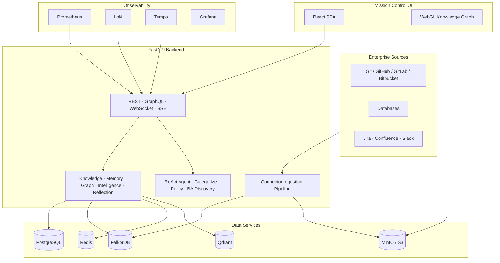
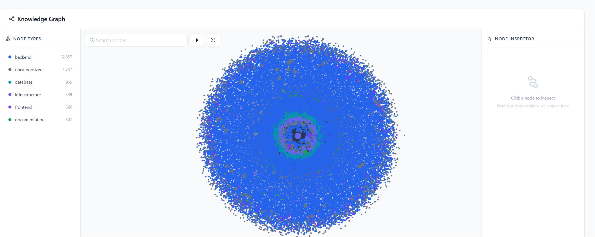
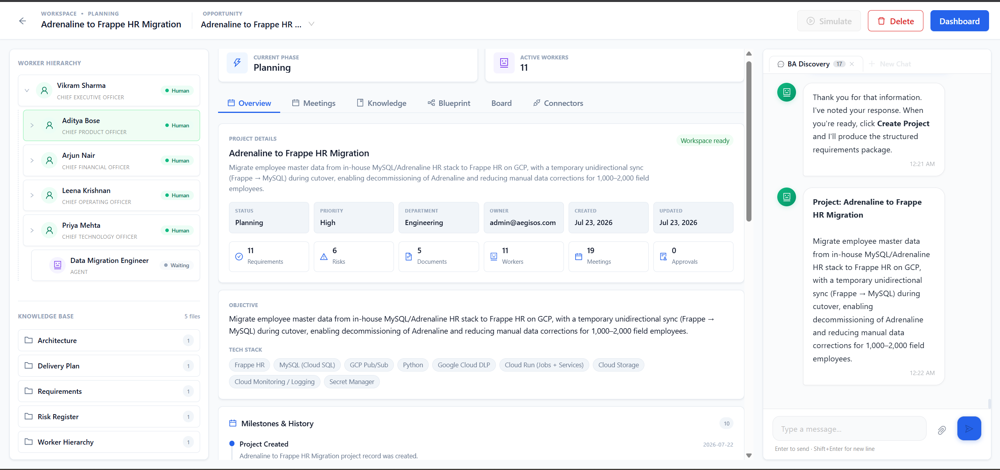
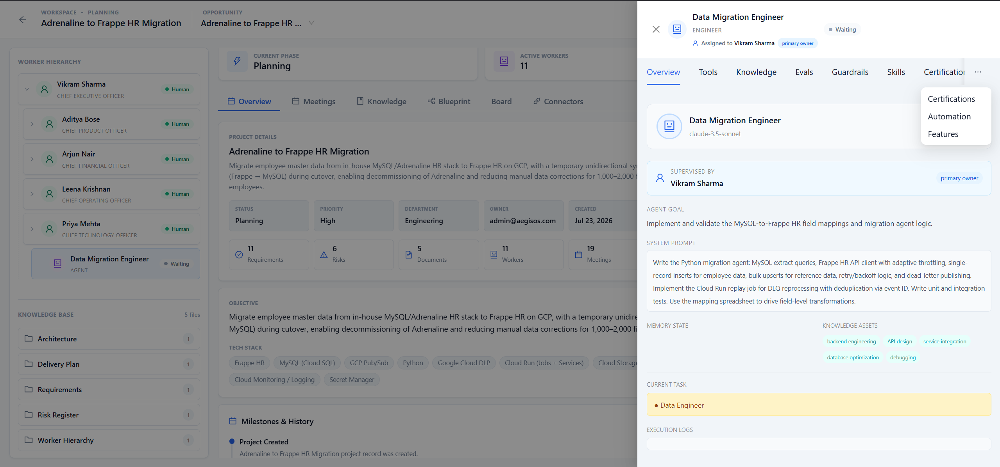
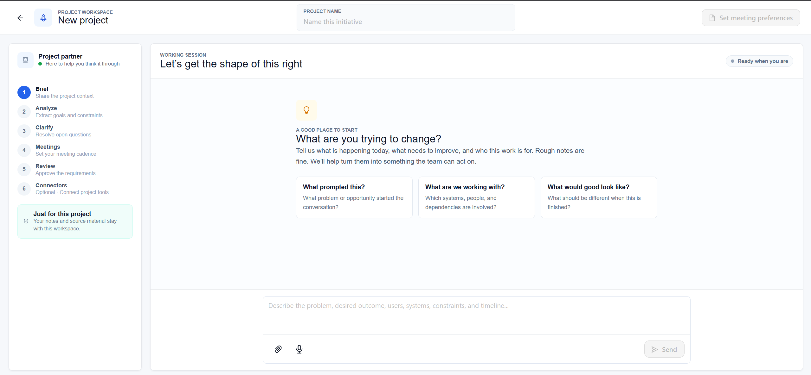
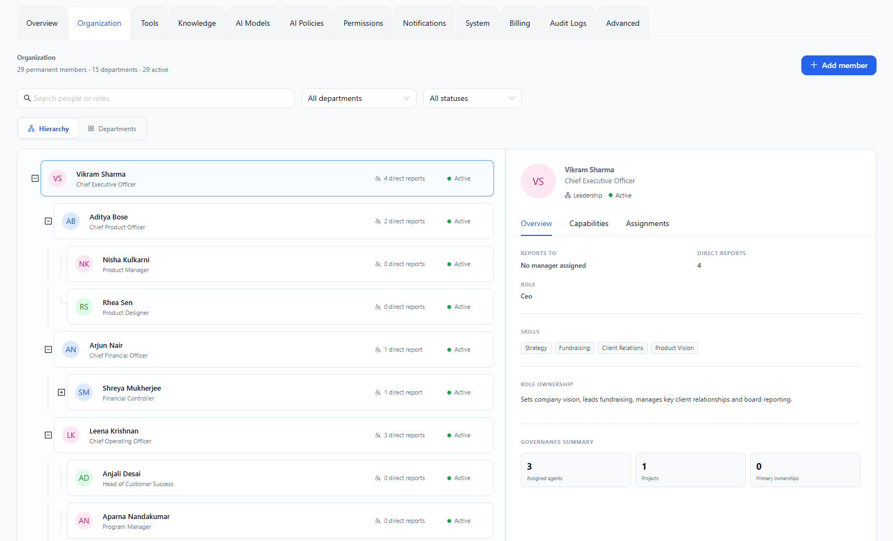

# AegisOS (AI Workforce OS)

> 🏢 Enterprise AI Workforce Operating System | 🌐 Live: https://aegisos.tailb5c137.ts.net/

<p align="center">

[](LICENSE)
[](https://python.org)
[](https://typescriptlang.org)
[](https://fastapi.tiangolo.com)
[](https://react.dev)
[](https://docker.com)
[](https://github.com/Brajesh9373/AegisOs/commits/main)

</p>

<h3 align="center">Enterprise AI Workforce Operating System</h3>

<p align="center">
AegisOS is the execution layer for AI-native organizations. Connect enterprise systems, turn fragmented information into governed knowledge, and coordinate AI workers with memory, evaluations, guardrails, and human approvals.
</p>

<p align="center">
<a href="https://github.com/Brajesh9373/AegisOs"><strong>Explore the docs »</strong></a>
<a href="https://aegisos.tailb5c137.ts.net/"><strong>🌐 Live Demo</strong></a>
 ·
<a href="https://github.com/Brajesh9373/AegisOs/issues">Report Bug</a>
 ·
<a href="https://github.com/Brajesh9373/AegisOs/issues">Request Feature</a>
</p>

## ⚡ Quickstart

```bash
# Clone the repository
git clone https://github.com/Brajesh9373/AegisOs
cd AegisOs

# Start the full stack (handles DSH build + Docker automatically)
./scripts/start-aegisos.sh

# Or force rebuild everything
./scripts/start-aegisos.sh --build

# Access the application
# Frontend: http://localhost:3000
# Backend API: http://localhost:8000
# API Docs: http://localhost:8000/docs
```

**Requirements:**
- Docker 24+, 8GB RAM, 20GB disk space
- Node.js 22+ (for DSH bundle building)
- pnpm 11+ (for DSH dependency management)

**Environment Variables:**

| Variable | Description | Default |
|---|---|---|
| `ANTHROPIC_API_KEY` | Anthropic API key (or compatible proxy) | Required |
| `ANTHROPIC_BASE_URL` | Anthropic API base URL | `https://api.anthropic.com` |

### Start Building AI Agents

```python
# Define an agent profile with AI-suggested scopes
from ecms.agent_os.scope_analyzer import analyze_profile_scopes

# Get AI recommendations for memory, knowledge, and tool access
recommendations = await analyze_profile_scopes(
    name="Data Engineer",
    description="Manages ETL pipelines and data workflows",
    system_prompt="You are a data engineer specializing in...",
    role="Engineer"
)
# Returns: {memory_scope, knowledge_scope, tool_scope}
```

## Vision

We are building the enterprise execution layer for AI-native organizations.

Instead of replacing enterprise software with AI, we let organizations keep control while AI assists execution through governed agents, workflows, memory, knowledge graphs, and human approvals.

The platform is designed around one principle: AI should be able to move work forward, but every important action must remain observable, explainable, permissioned, and recoverable.

## Why AegisOS?

- **🤖 AI Agents with Governance** — Business Analyst, Compliance Officer, and custom agents with memory, knowledge graphs, and human-in-the-loop approvals
- **🔗 Multi-Source Connectors** — Ingest from Git, GitHub, GitLab, Jira, Confluence, Slack with async parallel extraction
- **🧠 Knowledge Graph** — FalkorDB-backed cognitive graph with AST code analysis and WebGL visualization
- **💾 Enterprise Memory** — 6 memory layers: working, episodic, semantic, procedural, long-term, organizational
- **🛡️ Built-in Guardrails** — Per-role templates, RBAC/ABAC policies, human approval queues
- **📊 Full Observability** — Prometheus, Grafana, Loki, Tempo integrated out of the box

## Current Features

- **Full business lifecycle** — Customer → Opportunity → AI Discovery → RFQ → Budget → Proposal → Approval → Project → Workspace
- **Multi-agent orchestration** with role-aware worker hierarchies, task delegation, and cross-team requests
- **Project workspaces** with worker trees, task boards, meetings, documents, connectors, guardrails, and AI chat
- **Connector ingestion pipeline** — Git, GitHub, GitLab, Bitbucket with async parallel extraction and immutable snapshots
- **Knowledge graph** — FalkorDB-backed cognitive graph with AST code analysis, ontology mapping, and WebGL visualization
- **Enterprise memory** across working, episodic, semantic, procedural, long-term, and organizational layers
- **Agent governance** with primary owners, monitors, approvers, and RBAC/ABAC policy engine
- **Agent evaluations**, certifications, skills, tool policies, and execution telemetry
- **Guardrails** with per-role templates, toggle controls, and test simulation
- **Human approval queues** — every important AI action is observable, explainable, permissioned, and recoverable
- **Real-time operations** with Prometheus, Grafana, Loki, and Tempo
- **Production deployment** assets for Docker Compose, Kubernetes, Helm, and Terraform

## Architecture



### How it works

1. **Connect** — Enterprise sources (Git repos, databases, SaaS) feed into the connector ingestion pipeline
2. **Ingest** — A coordinator clones, partitions, and extracts knowledge into checksummed graph batches
3. **Build** — A bounded graph writer commits batches to FalkorDB and publishes immutable Apache Arrow snapshots
4. **Understand** — The knowledge engine transforms raw data into validated cognitive objects with confidence scores
5. **Remember** — The memory engine activates relevant knowledge into working sets using embedding similarity
6. **Execute** — AI agents use tools, memory, graph context, and guardrails to do real work
7. **Govern** — Humans review, approve, pause, cancel, or audit actions at every boundary

## Agent Hierarchy (DSH)

Engineering work runs on persistent [DeepSeek Harness](https://github.com/deepseek-ai/deepseek-harness)
agents: a Head of Engineering (HOE) leading senior Frontend/Backend engineers,
each with its own durable session, platform memory (episodic, procedural,
preferences, org patterns), and agent-initiated memory tools.

### Quick Start

```bash
# Start everything (builds DSH bundle + Docker images automatically)
./scripts/start-aegisos.sh

# Force rebuild DSH + images
./scripts/start-aegisos.sh --build

# Stop all services
./scripts/start-aegisos.sh --down

# View logs
./scripts/start-aegisos.sh --logs
```

### DSH Bundle Build Process

The `scripts/start-aegisos.sh` script handles the DSH bundle preparation:

1. **Dependency installation** — `pnpm install` in `DSH/`
2. **TypeScript compilation** — `tsc -b tsconfig.host.json` (requires ~4GB RAM)
3. **Bundle creation** — `tsdown --env.DSH_BUILD_FACE host`
4. **Tarball packaging** — `dsh-full.tgz` (excludes `.git/` and `node_modules/.cache/`)

The bundle is then copied into the Docker image via `COPY dsh-full.tgz /tmp/`,
avoiding OOM issues during `docker build` (the build container has limited RAM).

### Anthropic Adapter

The `packages/llm/llm-anthropic/` package registers an `anthropic` provider
route for DSH's LLM seam. It supports:
- Anthropic Messages API (native)
- OpenAI-compatible gateways (LiteLLM, proxies)
- Custom models like `meituan/LongCat-2.0:free`

### Agent Profiles

Seeded profiles in PostgreSQL:

| Profile ID | Role | Provider |
|---|---|---|
| `head-of-engineering` | HOE (delegation depth 3) | anthropic |
| `senior-frontend-engineer` | Frontend specialist (depth 2) | anthropic |
| `senior-backend-engineer` | Backend specialist (depth 2) | anthropic |

### Runtime Environment

| Variable | Meaning | Default |
|---|---|---|
| `DSH_REPO` | DSH checkout the launcher runs from | `/app/DSH` |
| `ANTHROPIC_API_KEY` | LLM API key for agent sessions | Required |
| `ANTHROPIC_BASE_URL` | LLM API base URL | `https://api.anthropic.com` |
| `AEGISOS_API_URL` | Backend URL the memory tools call back to | `http://127.0.0.1:8000` |
| `ECMS_SERVICE_TOKEN` | Trust token for BFF→ECMS service calls | unset (BFF proxying disabled) |

### Request Flow

Browser → Express BFF (`:3001`, owns browser auth) → explicit
`/api/discovery/*`, `/api/hierarchy/*`, `/api/projects/:id/workspace*` routes
→ ECMS Python backend (`:8000`) → per-agent `dsh --profile sdk` subprocesses.
The BFF serves everything else itself; ECMS never trusts browser tokens,
only the service token.

### Key API Surfaces

- `POST /api/hierarchy/teams/spawn-for-project` — spawn + BA handoff
- `POST .../by-project/{id}/kickoff` — breakdown → delegate → review
- `POST /api/projects/{id}/workspace/chat` — HOE reply
- `Engineering Team` page in the UI (live spawn/chat/delegate console)

## Tech Stack

- **Backend:** Python 3.12+, FastAPI, Pydantic v2, SQLAlchemy 2.0 async, Alembic, Strawberry GraphQL, uvicorn
- **Frontend:** React 18, TypeScript, Ant Design v6, Vite/Turborepo, pnpm workspaces, TanStack React Query
- **Agent runtime:** ReAct agent loop, OpenAI-compatible model APIs, CommandCode CLI, MCP tools
- **Memory:** Working and session memory, episodic memory (Mem0 + Qdrant), GBrain, semantic/procedural/organizational layers
- **Knowledge graph:** FalkorDB/Redis Graph, UKO/UCO domain model, Apache Arrow snapshots, WebGL visualization (Cosmos.gl + D3.js)
- **Database:** PostgreSQL 16 with tenant-scoped repositories, Unit of Work pattern, and Saga support
- **Async processing:** Redis Streams, durable leases, retries, and stale-delivery recovery
- **Object storage:** MinIO or any S3-compatible store for manifests, staged batches, and snapshots
- **Vector store:** Qdrant for embeddings and semantic search
- **Connectors:** Git, GitHub, GitLab, Bitbucket, MySQL, Jira, Confluence, Slack, MCP connector framework
- **Security:** JWT authentication, RBAC/ABAC authorization, encrypted configuration, tenant isolation
- **Observability:** Prometheus, Grafana, Loki, Tempo, structured logs, health probes, and operational alerts
- **Infrastructure:** Docker Compose, Kubernetes, Helm, Terraform
- **Quality:** pytest, Ruff, mypy, Vitest, Playwright, migration qualification tests

## Roadmap

### Q3 — Foundation and production hardening

- Complete large-repository ingestion qualification and soak testing
- Expand connector catalog and managed-secret flows
- Improve graph exploration for very large snapshots
- Add richer agent evaluations, certifications, and guardrail policies
- Harden tenant quotas, audit trails, and approval workflows

### Q4 — Enterprise rollout

- SSO, SCIM, enterprise identity providers, and advanced organization controls
- More database, ticketing, communication, and document connectors
- Multi-region object storage and disaster-recovery runbooks
- Delivery analytics, cost controls, and workforce effectiveness reporting
- General availability release with documented support and upgrade procedures

### Beyond

- Cross-project organizational intelligence
- Policy-aware autonomous execution with configurable autonomy levels
- Marketplace for agents, skills, tools, and connector extensions

## Screenshots

## Knowledge graph



### Project workspace



### Agent profile



### Create project



### Organisation



## Local Development

### Full stack with Docker

```bash
docker compose -f docker/docker-compose.yml up --build
```

Common local endpoints:

- Frontend: `http://localhost:3000`
- Backend API: `http://localhost:8000`
- API documentation: `http://localhost:8000/docs`
- Prometheus: `http://localhost:9090`
- Grafana: `http://localhost:3300`
- MinIO console: `http://localhost:9001`

### Backend development

```bash
cd backend
uv sync --group dev
uv run uvicorn ecms.main:app --reload
uv run pytest --no-cov
uv run ruff check ecms tests
uv run mypy ecms
```

### Frontend development

```bash
cd frontend
pnpm install
pnpm dev
```

## Documentation

- [Architecture](docs/ARCHITECTURE.md)
- [Backend architecture](docs/backend-architecture.md)
- [Agent system](docs/agent-system.md)
- [Knowledge graph](docs/knowledge-graph.md)
- [Memory model](docs/memory.md)
- [Security](docs/security.md)
- [Connector ingestion operations](docs/connector-ingestion-operations.md)
- [Knowledge graph V2 operations](docs/knowledge-graph-v2-operations.md)
- [Deployment](docs/deployment.md)
- [Testing](docs/testing.md)
- [Integration guide](docs/integration-guide.md)

## Contributing

Contributions are welcome! Please read our [Contributing Guide](CONTRIBUTING.md) for details on how to set up the development environment and submit pull requests.

## Code of Conduct

Please read our [Code of Conduct](CODE_OF_CONDUCT.md) to keep our community approachable and respectable.

## License

This project is licensed under the [Apache License 2.0](LICENSE).

---

<p align="center">
⭐ Star us on GitHub — it helps us grow! | 🐛 <a href="https://github.com/Brajesh9373/AegisOs/issues">Open an Issue</a> | 💬 <a href="https://github.com/Brajesh9373/AegisOs/discussions">Join Discussion</a>
</p>
