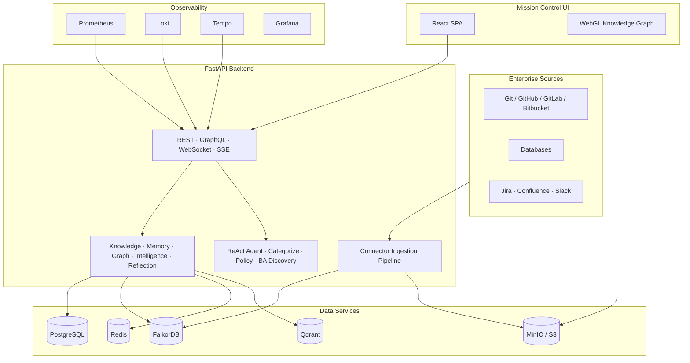

# AegisOS

Enterprise AI Workforce Operating System

AegisOS is the execution layer for AI-native organizations. It connects enterprise systems, turns fragmented information into governed knowledge, and coordinates AI workers with memory, evaluations, guardrails, and human approvals.

## Vision

We are building the enterprise execution layer for AI-native organizations.

Instead of replacing enterprise software with AI, we let organizations keep control while AI assists execution through governed agents, workflows, memory, knowledge graphs, and human approvals.

The platform is designed around one principle: AI should be able to move work forward, but every important action must remain observable, explainable, permissioned, and recoverable.

## Current Features

- **Full business lifecycle** — Customer → Opportunity → AI Discovery → RFQ → Budget → Proposal → Approval → Project → Workspace
- **Multi-agent orchestration** with role-aware worker hierarchies, task delegation, and cross-team requests
- **Project workspaces** with worker trees, task boards, meetings, documents, connectors, guardrails, and AI chat
- **Connector ingestion pipeline** — Git, GitHub, GitLab, Bitbucket with async parallel extraction and immutable snapshots
- **Knowledge graph** — FalkorDB-backed cognitive graph with AST code analysis, ontology mapping, and WebGL visualization
- **Enterprise memory** across working, episodic, semantic, procedural, long-term, and organizational layers
- **Agent governance** with primary owners, monitors, approvers, and RBAC/ABAC policy engine
- **Agent evaluations**, certifications, skills, tool policies, and execution telemetry
- **Guardrails** with per-role templates, toggle controls, and test simulation
- **Human approval queues** — every important AI action is observable, explainable, permissioned, and recoverable
- **Real-time operations** with Prometheus, Grafana, Loki, and Tempo
- **Production deployment** assets for Docker Compose, Kubernetes, Helm, and Terraform

## Architecture



### How it works

1. **Connect** — Enterprise sources (Git repos, databases, SaaS) feed into the connector ingestion pipeline
2. **Ingest** — A coordinator clones, partitions, and extracts knowledge into checksummed graph batches
3. **Build** — A bounded graph writer commits batches to FalkorDB and publishes immutable Apache Arrow snapshots
4. **Understand** — The knowledge engine transforms raw data into validated cognitive objects with confidence scores
5. **Remember** — The memory engine activates relevant knowledge into working sets using embedding similarity
6. **Execute** — AI agents use tools, memory, graph context, and guardrails to do real work
7. **Govern** — Humans review, approve, pause, cancel, or audit actions at every boundary

## Tech Stack

- **Backend:** Python 3.12+, FastAPI, Pydantic v2, SQLAlchemy 2.0 async, Alembic, Strawberry GraphQL, uvicorn
- **Frontend:** React 18, TypeScript, Ant Design v6, Vite/Turborepo, pnpm workspaces, TanStack React Query
- **Agent runtime:** ReAct agent loop, OpenAI-compatible model APIs, CommandCode CLI, MCP tools
- **Memory:** Working and session memory, episodic memory (Mem0 + Qdrant), GBrain, semantic/procedural/organizational layers
- **Knowledge graph:** FalkorDB/Redis Graph, UKO/UCO domain model, Apache Arrow snapshots, WebGL visualization (Cosmos.gl + D3.js)
- **Database:** PostgreSQL 16 with tenant-scoped repositories, Unit of Work pattern, and Saga support
- **Async processing:** Redis Streams, durable leases, retries, and stale-delivery recovery
- **Object storage:** MinIO or any S3-compatible store for manifests, staged batches, and snapshots
- **Vector store:** Qdrant for embeddings and semantic search
- **Connectors:** Git, GitHub, GitLab, Bitbucket, MySQL, Jira, Confluence, Slack, MCP connector framework
- **Security:** JWT authentication, RBAC/ABAC authorization, encrypted configuration, tenant isolation
- **Observability:** Prometheus, Grafana, Loki, Tempo, structured logs, health probes, and operational alerts
- **Infrastructure:** Docker Compose, Kubernetes, Helm, Terraform
- **Quality:** pytest, Ruff, mypy, Vitest, Playwright, migration qualification tests

## Roadmap

### Q3 — Foundation and production hardening

- Complete large-repository ingestion qualification and soak testing
- Expand connector catalog and managed-secret flows
- Improve graph exploration for very large snapshots
- Add richer agent evaluations, certifications, and guardrail policies
- Harden tenant quotas, audit trails, and approval workflows

### Q4 — Enterprise rollout

- SSO, SCIM, enterprise identity providers, and advanced organization controls
- More database, ticketing, communication, and document connectors
- Multi-region object storage and disaster-recovery runbooks
- Delivery analytics, cost controls, and workforce effectiveness reporting
- General availability release with documented support and upgrade procedures

### Beyond

- Cross-project organizational intelligence
- Policy-aware autonomous execution with configurable autonomy levels
- Marketplace for agents, skills, tools, and connector extensions

## Screenshots

### Knowledge graph — connected source view


### Knowledge graph — clustered view


<!-- Add approved captures for the following views under docs/screenshots/:
- Mission Control dashboard
- Project workspace and worker hierarchy
- Administration and connector catalog
- Agent profile, evaluations, and guardrails
-->

## Local Development

### Full stack with Docker

```bash
docker compose -f docker/docker-compose.yml up --build
```

Common local endpoints:

- Frontend: `http://localhost:3000`
- Backend API: `http://localhost:8000`
- API documentation: `http://localhost:8000/docs`
- Prometheus: `http://localhost:9090`
- Grafana: `http://localhost:3300`
- MinIO console: `http://localhost:9001`

### Backend development

```bash
cd backend
uv sync --group dev
uv run uvicorn ecms.main:app --reload
uv run pytest --no-cov
uv run ruff check ecms tests
uv run mypy ecms
```

### Frontend development

```bash
cd frontend
pnpm install
pnpm dev
```

## Documentation

- [Architecture](docs/ARCHITECTURE.md)
- [Backend architecture](docs/backend-architecture.md)
- [Agent system](docs/agent-system.md)
- [Knowledge graph](docs/knowledge-graph.md)
- [Memory model](docs/memory.md)
- [Security](docs/security.md)
- [Connector ingestion operations](docs/connector-ingestion-operations.md)
- [Knowledge graph V2 operations](docs/knowledge-graph-v2-operations.md)
- [Deployment](docs/deployment.md)
- [Testing](docs/testing.md)
- [Integration guide](docs/integration-guide.md)

## License

This project is licensed under the [Apache License 2.0](LICENSE).
