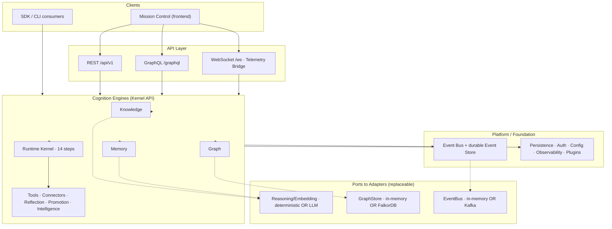
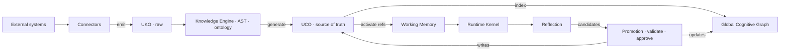

# ECMS Backend — Complete Technical Guide

**Enterprise Cognitive Memory System (ECMS)** — the backend "cognitive operating system"
that continuously converts fragmented enterprise information into structured organizational
understanding: a single, continuously‑evolving **Global Cognitive Graph** with intelligent
memory, agent coordination, and complete explainability.

This document explains the **entire backend**: what it does, how it is structured, every
subsystem, every technology used and *why*, the domain model, the event model, the API
surface, how it is deployed, and how it is verified.

> **Status:** Backend cognition complete (Foundation 22 stages + Backend 20 phases).
> **358 tests passing · 97% coverage · mypy‑strict clean · full acceptance gate green.**
> ~413 Python files, ~10.8k LOC in `ecms/`.

---

## Table of Contents

1. [What ECMS Is](#1-what-ecms-is)
2. [Non‑Negotiable Architectural Invariants](#2-nonnegotiable-architectural-invariants)
3. [Technology Stack — What Is Used and Why](#3-technology-stack--what-is-used-and-why)
4. [Repository & Package Layout](#4-repository--package-layout)
5. [Architecture: Hexagonal + DDD + Event‑Driven](#5-architecture-hexagonal--ddd--eventdriven)
6. [The Domain Model](#6-the-domain-model)
7. [The Cognition Engines](#7-the-cognition-engines)
8. [The Runtime Kernel Pipeline](#8-the-runtime-kernel-pipeline)
9. [The Platform / Foundation Layer](#9-the-platform--foundation-layer)
10. [Event‑Driven Architecture & Event Catalog](#10-eventdriven-architecture--event-catalog)
11. [The API Layer](#11-the-api-layer)
12. [The Replaceable‑Adapter Pattern (Ports & Defaults)](#12-the-replaceableadapter-pattern-ports--defaults)
13. [Configuration & Settings](#13-configuration--settings)
14. [Security](#14-security)
15. [Observability](#15-observability)
16. [Deployment](#16-deployment)
17. [Testing & Quality Gates](#17-testing--quality-gates)
18. [Running the Backend](#18-running-the-backend)
19. [Statistics](#19-statistics)
20. [Glossary](#20-glossary)

---

## 1. What ECMS Is

Enterprise knowledge is fragmented across Git, Jira, Confluence, Slack, databases,
documentation, source code, APIs, cloud platforms, and monitoring systems. Humans
understand the relationships between these; software does not. **ECMS continuously converts
that fragmented information into structured organizational understanding.**

The backend does this by:

- **Observing** enterprise systems through **connectors** (which emit raw *knowledge objects*).
- **Understanding** them in the **Knowledge Engine** (AST code analysis, ontology mapping,
  generation of *cognitive objects*).
- **Indexing** understanding into **one Global Cognitive Graph**.
- **Activating** the most relevant knowledge on demand through the **Memory Runtime**.
- **Executing** work through a deterministic **Runtime Kernel** that coordinates agents,
  plans, tools, reflection, and knowledge promotion.
- **Learning** from every execution via **Reflection → Promotion** (the only path that writes
  new enterprise knowledge).
- **Exposing** everything over REST/GraphQL/WebSocket with full explainability and real‑time
  telemetry.

### Core mental model

```
Connectors → UKO (raw)  ──►  Knowledge Engine  ──►  UCO (understanding)  ──►  Graph (index)
                                                          ▲                        │
                                        Reflection ─► Promotion ◄── Memory activates knowledge
```

- **UKO** = Universal *Knowledge* Object = raw information, exactly as collected. No reasoning.
- **UCO** = Universal *Cognitive* Object = enterprise understanding. The **source of truth**.
- **Graph** = an **index** over UCOs. Never the source of truth.
- **Memory** *activates* knowledge for a task; it never *owns* knowledge.

### Architecture at a glance

Clients reach the platform only through the API layer, which delegates to the **Kernel API**
(`create_cognitive_system()`); heavy dependencies sit behind **ports** with offline defaults
(dotted edges). *(Rendered with Mermaid — GitHub and the MkDocs site display it graphically;
see also the [Backend Architecture](../docs/backend-architecture.md) docs page for the full
set of diagrams.)*



**Knowledge lifecycle and the learning loop** — connectors emit raw UKOs, the Knowledge Engine
produces UCOs (the source of truth), the Graph indexes them, Memory activates references, and
Reflection → Promotion is the only path that writes new knowledge back:



---

## 2. Non‑Negotiable Architectural Invariants

These are enforced throughout the codebase and must never be violated:

1. **One Global Cognitive Graph.** "Task Graphs", "Session Graphs", and "Knowledge Graphs"
   are only **filtered views (projections)** of the same graph — never separate graphs.
2. **UCO is the source of truth; the graph is an index.** Never reverse this.
3. **Memory activates knowledge, never owns it.** Knowledge belongs to ECMS, not to models.
4. **Everything communicates via events** (publish → bus → subscribers). No hidden coupling.
5. **Everything is replaceable.** Heavy dependencies (LLM, graph DB, broker, cache, storage,
   secrets) sit behind **ports** with dependency‑free defaults.
6. **Plugins are first‑class.** Tools, connectors, agents, and knowledge extractors are
   pluggable; nothing is hardcoded where a plugin belongs.
7. **Everything is explainable.** Every decision, activation, and promotion is traceable.
8. **Interfaces are frozen contracts.** Implementations may change; the Part‑5 ports may not.
9. **Promotion is the *only* write path for enterprise knowledge.** Reflection proposes;
   promotion validates and writes.
10. **Connectors emit UKOs only.** All UCO generation happens in the Knowledge Engine.
11. **The Graph never reasons; tools only execute; the Runtime reaches the Graph via an
    interface** (never a database driver directly).

---

## 3. Technology Stack — What Is Used and Why

**Language / runtime:** Python **3.12** (uses `StrEnum`, PEP 695 generics, `X | Y` unions).
**Package/build:** [`uv`](https://github.com/astral-sh/uv) for env & lockfile; **hatchling** build backend; single installable package `ecms`.

### Runtime dependencies (`pyproject.toml`)

| Library | Version | What it is used for |
|---|---|---|
| **fastapi** | ≥0.116 | The ASGI web framework — REST gateway, dependency injection, auto OpenAPI. |
| **uvicorn[standard]** | ≥0.35 | ASGI server that runs the app (`uvicorn ecms.main:app`). |
| **pydantic** | ≥2.11 | Typed domain models & validation. Every model/value object is a Pydantic model. |
| **pydantic‑settings** | ≥2.10 | Typed, env‑driven configuration (`ECMS_`‑prefixed settings). |
| **structlog** | ≥25.1 | Structured (JSON/console) logging with ambient context + secret redaction. |
| **typer** | ≥0.15 | The `ecms` CLI (serve / worker / roles / version). |
| **pyyaml** | ≥6.0 | Layered YAML configuration sources. |
| **httpx** | ≥0.28 | Async HTTP client — used by the HTTP tool and connectors. |
| **pyjwt** | ≥2.10 | JWT encode/decode for authentication tokens (with key rotation). |
| **bcrypt** | ≥4.2 | Password hashing (`BcryptPasswordHasher`). |
| **prometheus‑client** | ≥0.21 | Metrics registry + `/metrics` exposition. |
| **opentelemetry‑api / ‑sdk** | ≥1.29 | Distributed tracing (`traced_span`, OTLP export to Tempo). |
| **strawberry‑graphql** | ≥0.240 | GraphQL schema served at `/graphql`. |
| **sqlalchemy[asyncio]** | ≥2.0.36 | Async ORM — persistence models, repositories, unit of work, event store. |
| **asyncpg** | ≥0.30 | Async PostgreSQL driver used by SQLAlchemy in production. |
| **alembic** | ≥1.14 | Database migrations (versions `0001`–`0003`). |
| **redis** | ≥5.2 | Redis cache adapter (`RedisCache`) behind the `Cache` port. |
| **boto3** | ≥1.35 | S3/MinIO object storage adapter (`S3ObjectStore`) behind the `ObjectStore` port. |
| **cryptography** | ≥44.0 | Symmetric encryption in the `EncryptionService` (data‑centric security). |

### Development dependencies

| Library | Purpose |
|---|---|
| **pytest**, **pytest‑asyncio**, **pytest‑cov**, **pytest‑benchmark** | Test runner (async auto‑mode), coverage, micro‑benchmarks. |
| **ruff** | Linter **and** formatter (single tool). Rule set below. |
| **mypy** | Static type checker in **strict** mode. |
| **types‑PyYAML**, **boto3‑stubs[s3]** | Type stubs for third‑party libs. |
| **aiosqlite** | In‑process async SQLite so persistence/event‑store tests run offline. |
| **fakeredis** | In‑memory Redis so cache tests run offline. |
| **mkdocs**, **mkdocs‑material** | Documentation site (`mkdocs build --strict`). |

### Tooling policy (also in `pyproject.toml`)

- **ruff** — line length 100, target py312, rule families:
  `E, F, I, UP, B, SIM, C4, PTH, RUF, ASYNC, S, N, D` (pycodestyle, pyflakes, isort,
  pyupgrade, bugbear, simplify, comprehensions, use‑pathlib, ruff, async, bandit‑security,
  pep8‑naming, pydocstyle). Google docstring convention. Per‑file ignores relax docstring/
  security rules for tests and interface stubs.
- **mypy** — `strict = true`, `disallow_untyped_defs`, `warn_return_any`,
  `warn_unused_ignores`, `warn_redundant_casts`. Migrations excluded.
- **pytest** — `asyncio_mode = "auto"`, branch coverage on `ecms`, `--cov-report=term-missing`.

**Dependency discipline (SECTION 88):** dependencies were added stage‑by‑stage only when the
stage that needed them arrived — no speculative dependencies.

---

## 4. Repository & Package Layout

The repository root **is** the `ecms/` enterprise monorepo:

```
kgraph/
├─ backend/            # ← this document covers backend/
│  ├─ ecms/            # the Python package (hexagonal DDD modules)
│  ├─ tests/           # unit / integration / contract / api / security / load / smoke / perf
│  ├─ config/          # layered configuration files
│  └─ pyproject.toml   # deps + ruff/mypy/pytest config
├─ frontend/           # Next.js "Mission Control" (separate build)
├─ providers/          # provider/connector plugin packages
├─ plugins/            # plugin packages
├─ docker/             # Dockerfiles + docker-compose + observability configs
├─ kubernetes/         # kustomize base + Helm chart
├─ terraform/          # infrastructure baseline
├─ docs/               # MkDocs Material documentation site
├─ benchmarks/  examples/  legacy/  scripts/
└─ CHANGELOG.md  README.md  mkdocs.yml
```

### `backend/ecms/` packages

| Package | Layer | Responsibility |
|---|---|---|
| `shared` | Kernel | Base models, value objects, enums, event base, exceptions, context, ids, time, validation, ports. |
| `configuration` | Foundation | Typed settings + layered configuration service (history/rollback). |
| `infrastructure` | Foundation | DI container, telemetry (log/metrics/tracing), cache, storage, secrets, deterministic reasoning. |
| `events` | Foundation | Enterprise event bus + durable event store + topics + (de)serialization. |
| `persistence` | Foundation | SQLAlchemy engine/models/repositories, Unit of Work, Saga, Alembic migrations. |
| `auth` | Foundation | Authentication (JWT), authorization (RBAC/ABAC), encryption, compliance, security analytics. |
| `plugins` | Foundation | Plugin framework, registry, workflow engine, automation engine. |
| `knowledge` | Cognition | AST code analysis → ontology → UCO generation → semantic search. |
| `graph` | Cognition | The one Global Cognitive Graph: nodes/edges/traversal/expansion/views. |
| `memory` | Cognition | Activation / ranking / cache / compression. Reference‑only. |
| `runtime` | Cognition | The Runtime Kernel pipeline + task/session/agent managers. |
| `tools` | Cognition | Sandboxed tool runtime + Filesystem/HTTP tools. |
| `providers` | Cognition | Universal connector framework + Filesystem connector. |
| `reflection` | Cognition | Distills lessons/patterns; proposes knowledge candidates. |
| `promotion` | Cognition | Validates/dedupes/merges candidates and writes knowledge (sole write path). |
| `intelligence` | Cognition | Planner / Goal / Strategy / Decision / Capability engines. |
| `monitoring` | Ops | Diagnostics engine + alert engine. |
| `analytics` | Ops | Cross‑domain analytics service. |
| `websocket` | API | Event‑bus → WebSocket telemetry bridge + wire envelope. |
| `api` | API | FastAPI app factory, REST/GraphQL/WS routers, middleware, error handlers. |
| `sdk` | Facade | `EcmsSDK`, `create_cognitive_system`, `SimulationEnvironment`. |
| `cli` | Facade | Typer CLI (`serve`, `worker`, `roles`, `version`). |
| `core` | — | Shared runtime primitives (thin). |
| `administration`, `visualization` | — | Reserved package roots (scaffold). |

Each cognition/foundation package follows the same **hexagonal DDD sub‑structure**:

```
<module>/
├─ domain/          # entities, value objects, pure logic (no I/O)
├─ application/     # use-cases / orchestration (thin)
├─ interfaces/      # Ports (Protocols/ABCs) — frozen contracts
├─ infrastructure/  # Adapters implementing the ports (I/O, libraries)
├─ services/        # the engine implementations
├─ repositories/    # persistence gateways
├─ events/          # event factory functions for this module
├─ schemas/         # (de)serialization schemas
└─ tests/           # module-local tests
```

**Dependency rule:** dependencies flow **inward** — `domain ← application ← infrastructure`.
Domain never imports infrastructure.

---

## 5. Architecture: Hexagonal + DDD + Event‑Driven

ECMS combines four disciplines:

- **Domain‑Driven Design** — the domain model (UKO/UCO/Task/Session/Memory/…) is the heart;
  everything is expressed in that ubiquitous language.
- **Hexagonal (Ports & Adapters)** — each subsystem exposes **ports** (`interfaces/`) and
  ships **adapters** (`infrastructure/`). The default adapter is always dependency‑free.
- **Clean/Layered** — inward dependency flow; the API layer never touches engines directly,
  only the **Kernel API** assembly (`create_cognitive_system`).
- **Event‑Driven** — subsystems publish events to the bus; other subsystems subscribe. E.g.
  Reflection subscribes to task completion; the WebSocket bridge subscribes to *everything*.

### Assembly: the Kernel API

`ecms/sdk/cognitive.py::create_cognitive_system()` wires the cognition engines over **one
shared knowledge index** and returns a `CognitiveSystem`:

```python
CognitiveSystem(
    knowledge = DefaultKnowledgeEngine(embedder, repository, event_bus),
    memory    = DefaultMemoryEngine(repository, embedder, event_bus),
    graph     = GraphEngine(event_bus),
    kernel    = RuntimeKernel(knowledge=repository, memory=..., graph=...,
                              planner=DefaultPlanner(...),
                              reflector=DefaultReflectionEngine(...),
                              promoter=DefaultPromotionEngine(...)),
    repository = InMemoryKnowledgeRepository(embedder),
)
```

The FastAPI app stores this on `app.state.cognitive`; every REST route delegates to it — the
API never reaches into an engine directly.

---

## 6. The Domain Model

All domain models live in `ecms/shared/models/` and are Pydantic models built on typed bases
in `models/base.py`:

- **`DomainModel`** — base for mutable domain entities.
- **`ImmutableModel`** — frozen; updates create *new versions* (used by UCO, Episode, Decision).
- **`TimestampedModel`**, **`AggregateRoot`** — created/updated tracking; aggregate identity.
- **`Attachment`**, **`SecurityPolicy`** — shared sub‑objects.

### Knowledge models (`models/knowledge.py`)

| Model | Kind | Purpose (key fields) |
|---|---|---|
| **UniversalKnowledgeObject (UKO)** | AggregateRoot | Raw provider snapshot — `provider`, `raw_content`, `checksum`, `attachments`, `processing_status`, `validation_status`. **No reasoning.** |
| **UniversalCognitiveObject (UCO)** | ImmutableModel | Understanding — `canonical_name`, `ontology_type`, `confidence/importance/business_value/reusability/stability` (0–100), `evidence`, `relationships`, `graph_node_id`, `activation_statistics`, `history`. **Source of truth.** |
| **Evidence** | DomainModel | Traceable link UCO→UKO — `uko_id`, `source`, `origin`, `checksum`, `reference`, `timestamp`. |
| **Relationship** | DomainModel | First‑class semantic edge — `source_uco`, `target_uco`, `relationship_type`, `weight`, `direction`, `version`, `history`. |
| **Episode** | ImmutableModel | Immutable record of how knowledge evolved — `episode_type`, `graph_changes`, `affected_relationships`, `artifacts`. |
| **ProviderRelationship** | DomainModel | Raw relationship discovered by a provider. |

### Work models (`models/work.py`)

- **Task** (AggregateRoot) — smallest executable unit: `goal`, `parent_task`/`child_tasks`
  (hierarchy), `priority`, `status`, `assigned_agents`, `working_memory_id`, `planner_output`,
  `tool_calls`, `generated_artifacts`, `knowledge_candidates`, `reflection_id`, `timeline`,
  `metrics`, `errors`.
- **Session** (AggregateRoot) — collaborative workspace: `participants`, `active_tasks`/
  `completed_tasks`, `timeline`, `architectural_decisions`, `active_knowledge`, `graph_view`.

### Memory models (`models/memory.py`)

- **WorkingMemory** — short‑lived per‑task workspace: `active_uco_references` (references, not
  copies), `scratchpad`, budgets (`token_budget`/`memory_budget`/`activation_budget`),
  `token_usage`, `expires_at`, `status`.
- **SessionMemory** — accumulates understanding across a session's tasks.
- **KnowledgeMemory** — index of permanent understanding: `uco_references`, `knowledge_edges`,
  `archive_policy`, `governance_policy`, `version_history`, statistics.

### Planning models (`models/planning.py`)

- **Goal** — derived from intent: `sub_goals`, `dependencies`, `constraints`,
  `success_criteria`, `status`.
- **ExecutionPlan** — versioned ordered plan: `strategy` (StrategyType), `steps`,
  `synchronization_points`, `validation_points`, `reflection_points`.
- **Decision** (ImmutableModel) — **explainable** choice: `question`, `chosen`, `rationale`,
  `considered_options`, `rejected_options`, `knowledge_used`, `memory_activated`, `confidence`.
  *(This is how ECMS explains "why" without exposing raw chain‑of‑thought.)*

### Reflection / runtime / agent / artifact

- **Reflection** — `mistakes`, `successes`, `patterns`, `improvements`, `knowledge_candidates`.
- **KnowledgeCandidate** — proposed learning carrying its own `validation_status`,
  `approval_status`, `promotion_status`, `proposed_uco`, `duplicate_candidates`.
- **RuntimeContext** — per‑execution scope an agent carries: `knowledge_scope`,
  `tool_permissions`, `execution_budget`, `timeout_seconds`, `retry_policy`.
- **ToolExecution** — auditable record of one tool call: `arguments`, `status`, `duration_ms`,
  `stdout`/`stderr`/`exit_code`, `generated_events`, `artifacts`.
- **Agent** — a runtime agent (role/status). **Artifact** — a generated output.

### Value objects (`shared/value_objects/`)

- **Scores** (0–100): `ConfidenceScore`, `ImportanceScore`, `BusinessValueScore`,
  `StabilityScore`, `ReusabilityScore`.
- **Budgets**: `TokenBudget`, `MemoryBudget`, `ActivationBudget`, `ExecutionBudget`.

### Enumerations (`shared/enums/`) — 19 enums

`SecurityClassification`, `LifecycleState`, `ProcessingStatus`, `ValidationStatus`,
**`EventCategory`** (16 values), `RelationshipDirection`, `TaskPriority`, `TaskStatus`,
`SessionStatus`, `MemoryStatus`, `AgentRole`, `AgentStatus`, `ToolExecutionStatus`,
`GoalStatus`, `ApprovalStatus`, `PromotionStatus`, `StrategyType`, `RelationshipType`,
`OntologyCategory`.

---

## 7. The Cognition Engines

### 7.1 Knowledge Engine (`ecms/knowledge/`)

Turns raw information into understanding. **Filename‑independent**: it understands code by
**AST**, not by file extension guessing.

- **`DefaultKnowledgeEngine`** — `ingest()` (UKO → UCOs full pipeline), `analyze()`,
  `extract_entities()`/`extract_relationships()`, `generate_uco()`, `validate()`, `publish()`
  (index + emit events), `search()` (embedding cosine similarity), `merge()`, `reindex()`.
- **Code analysis** (`infrastructure/code_analysis.py`): `PythonCodeAnalyzer` (Python `ast`),
  `GenericCodeAnalyzer` (regex import scanner for other languages), `detect_language()`,
  `analyze_code()` dispatcher, producing `CodeEntity` / `CodeRelationship` / `CodeAnalysis`.
- **Ontology** (`infrastructure/ontology.py`): `OntologyMapper.map_entity()` /
  `category_for()` — maps entities to configurable ontology types/categories.
- **Events:** `KnowledgeDiscovered`, `KnowledgeNormalized`, `KnowledgeValidated`,
  `KnowledgeRejected`, `KnowledgeVersionCreated`, `KnowledgeMerged`.

### 7.2 Graph Runtime (`ecms/graph/`)

The **one** Global Cognitive Graph. A UCO becomes a `GraphNode`; a `Relationship` becomes a
`GraphEdge`. **Views are projections, not new graphs.**

- **`GraphEngine`** — `upsert_uco()`, `create_relationship()`, `find_node()`, `neighbors()`,
  `delete_node()`/`delete_relationship()`, `shortest_path()` (BFS), `expand()` (multi‑hop
  neighborhood subgraph), `view()` (filtered projection), `statistics()` (counts/density).
- Default store is **in‑memory** (`infrastructure/memory_store.py`) behind a `GraphStore`
  port; the Graphiti→FalkorDB adapter is the deferred production swap‑in.
- **Events:** `NodeCreated`, `NodeUpdated`, `NodeDeleted`, `RelationshipCreated`,
  `RelationshipDeleted`.

### 7.3 Memory Runtime (`ecms/memory/`)

Activates the most relevant knowledge into a **bounded** working set. Stores **references
only** — memory activates knowledge, it never owns it.

- **`DefaultMemoryEngine`** — `activate()` (rank + select top‑K UCO references into working
  memory), `retrieve()` (semantic retrieval with cache), `release()`, `compress()`
  (summarize via the reasoner), `statistics()`.
- **`MemoryRankingEngine.score()`** with **`RankingWeights`** — the explainable ranking
  factors (relevance/importance/recency/…). **`MemoryCache`** — reference cache.
- **Events:** `WorkingMemoryCreated`, `WorkingMemoryActivated`, `WorkingMemoryReleased`,
  `SessionMemoryUpdated`, `MemoryPromotionStarted`, `MemoryPromotionCompleted`.

### 7.4 Tool Runtime (`ecms/tools/`)

Permission/policy/**sandbox**‑gated, fully audited tool execution.

- **`ToolManager.execute()`** — permission‑checked, audited execution producing a
  `ToolExecution` + events. **`ToolRegistry`** — register/lookup. **`ToolPermissionEngine`**
  and **`ToolPolicyEngine`** — allow/deny + command‑level policy. **`WorkspaceSandbox`** —
  path‑escape protection.
- Tools: **`FilesystemTool`** (sandboxed file ops), **`HttpTool`** (via `httpx`). Uniform
  `ToolRequest` / `ToolResult`.
- **Events:** `ToolExecutionStarted`, `ToolExecutionCompleted`, `ToolExecutionFailed`,
  `ToolPermissionDenied`, `ToolArtifactGenerated`.

### 7.5 Connector Runtime (`ecms/providers/`)

The universal framework for observing external systems. **Connectors emit UKOs only.**

- **`ConnectorManager`** (register/sync/full_sync/incremental_sync), **`ConnectorRegistry`**,
  **`CredentialManager`** (store/get/rotate/revoke), **`ChangeDetector`** (checksum‑based),
  **`BaseConnector`** (+`normalize()`), reference **`FilesystemConnector`**.
- **Events:** `ConnectorRegistered`, `SyncStarted`, `SyncCompleted`, `DiscoveryStarted`,
  `DiscoveryCompleted`, `UkoPublished`.

### 7.6 Reflection (`ecms/reflection/`)

- **`DefaultReflectionEngine`** — `reflect()` (summarize a task, derive patterns/improvements)
  and `generate_candidates()` (emit `KnowledgeCandidate`s). Subscribes to task completion.
- **Events:** `ReflectionStarted`, `ReflectionCompleted`, `PatternDiscovered`,
  `ImprovementSuggested`, `KnowledgeCandidateGenerated`.

### 7.7 Knowledge Promotion (`ecms/promotion/`)

**The sole path that writes enterprise knowledge.** validate → dedup → confidence → policy →
approval → promote → graph.

- **`DefaultPromotionEngine.promote()`** — validates candidates, detects duplicates,
  auto‑approves or queues for **human approval**, writes to knowledge + graph, tracks stats.
- **Events:** `KnowledgeCandidateValidated`, `KnowledgeCandidateRejected`, `KnowledgePromoted`,
  `KnowledgeMerged`.

### 7.8 Intelligence Layer (`ecms/intelligence/`)

Compiles intent into an explainable, versioned plan (it **describes** work; it never executes).

- **`DefaultPlanner.plan()`** orchestrates: **`GoalEngine.decompose()`** (root/sub‑goals) →
  **`StrategyEngine.select()`** (choose a `StrategyType`) → **`DecisionEngine.decide()`**
  (record explainable `Decision`s) → build an `ExecutionPlan`. **`CapabilityEngine.discover()`**
  finds available tools/connectors.
- **Events:** `PlannerStarted`, `PlannerCompleted`.

### 7.9 Plugins (`ecms/plugins/`)

- **`PluginRegistry`** — register, dependency‑order lifecycle, health, capability discovery,
  hot reload. **`BasePlugin`** + **`PluginManifest`** + **`PluginState`**. **`load_plugin()`**
  dynamically imports `module:ClassName`.
- **`WorkflowEngine`** (`Workflow`/`WorkflowStep`, fluent `.step()`) and **`AutomationEngine`**
  (`AutomationRule` — event → handler) provide declarative orchestration/automation.

---

## 8. The Runtime Kernel Pipeline

`ecms/runtime/services/kernel.py::RuntimeKernel.execute(prompt, org, user, session?)` runs
**one deterministic pipeline** for every request. Each stage emits an event; stages whose
optional collaborators aren't wired are skipped.

```
 1. Get/create Session          (SessionManager)          → SessionCreated
 2. Create Task                 (TaskManager)             → TaskCreated
 3. Attach task to session      (SessionManager.add_task)
 4. Emit PromptReceived
 5. Start task                  (TaskManager.start)       → TaskStarted
 6. Create + assign Agent       (AgentOrchestrator)       → AgentCreated / AgentAssigned
 7. Plan                        (Planner.plan)            → PlannerStarted / PlannerCompleted
 8. Activate Working Memory     (MemoryEngine.activate)   → WorkingMemory* events
 9. Resolve activated UCOs      (KnowledgeRepository.get)
10. Run tools (optional)        (ToolRunner.run)          → ToolExecution* events
11. Reflect (optional)          (Reflector.reflect)       → Reflection* events
    → generate KnowledgeCandidates
12. Promote (optional)          (Promoter.promote)        → Knowledge* events
13. Update Graph                (GraphEngine.upsert_uco)  → NodeCreated/Updated
14. Release Working Memory + Complete Task                → WorkingMemoryReleased / TaskCompleted
```

Returns an **`ExecutionResult`** capturing `session_id`, `task_id`, `agent_id`, `plan_id`,
`activated_uco_ids`, `tool_executions`, `reflection_id`, `knowledge_candidates`, `graph_nodes`,
`summary`, and `status`. On any exception the task is failed (`TaskFailed`) and the error
re‑raised. Because the pipeline is deterministic and every step emits an event, executions are
**replayable and explainable**.

**Determinism for tests:** a scripted `ReasoningProvider` can be injected so the whole pipeline
runs offline and reproducibly.

---

## 9. The Platform / Foundation Layer

### 9.1 `shared` — the kernel

Base models & value objects (above), the **19 enums**, the base **event contract**
(`BaseEvent`, `make_event`), typed **exceptions** (`EcmsError` + `ValidationError`,
`NotFoundError`, `ConflictError`, `AuthenticationError`, `AuthorizationError`,
`ConfigurationError`, `SerializationError`, `RepositoryError`, `EventError`, `PluginError`,
`RateLimitedError`, `DependencyResolutionError`), async **request context**
(`RequestContext`, `current_context`, `bind_context`, `get_correlation_id`), **ids**
(`new_id`, `new_uuid`, `new_correlation_id`), **time** (`utcnow`, `to_iso`, `from_iso`),
**security** (`redact`, `constant_time_compare`), and the core **ports**:
`Repository[T]`, `EventPublisher`/`EventSubscriber`, `HealthProbe`, and the
**`ReasoningProvider`/`EmbeddingProvider`** ports that decouple ECMS from any specific LLM.

### 9.2 `events` — the enterprise event bus

- **`InMemoryEventBus`** — publish/subscribe with **type & category filters**, at‑least‑once
  delivery with retry → **dead‑letter**, **idempotent** publish (dedupe by `event_id`),
  **replay** from the store, metrics, health.
- **`InMemoryEventStore`** (default) and **`PersistentEventStore`** (durable, append‑only,
  SQL‑backed with a monotonic `sequence`) implementing the `EventStore` port. This append‑only
  store makes the platform **event‑sourced** — state can be rebuilt by replay.
- **`TopicRegistry`** / `event_topic()` / `all_topics()` — the per‑category Kafka topic
  taxonomy. **`serialize_event`/`deserialize_event`** — JSON (de)serialization.

### 9.3 `persistence`

Async SQLAlchemy 2.0. **`Database`** (engine/session), ORM **`Base`**, records
(`AggregateRecord`, `AuditRecord`, `EventRecord`), **`AggregateRepository[T]`** /
**`AuditRepository`**, **`UnitOfWork`** (transactional boundary), **`Saga`** /
`SagaStep` / `SagaError` (compensating multi‑step transactions), and **Alembic** migrations
`0001_initial`, `0002_aggregates`, `0003_event_store`. Soft‑delete + multi‑tenant org scoping
are built into the aggregate layer.

### 9.4 `infrastructure`

- **DI:** `Container` with `Lifetime` (singleton/scoped/transient) + `Scope`.
- **Telemetry:** `configure_logging`/`get_logger` (structlog), `MetricsRegistry`
  (prometheus‑client), `configure_tracing`/`get_tracer`/`traced_span` (OpenTelemetry).
- **Cache:** `Cache` port + `InMemoryCache` / `RedisCache`.
- **Storage:** `ObjectStore` port + `InMemoryObjectStore` / `S3ObjectStore` (boto3/MinIO).
- **Secrets:** `SecretsProvider` port + `EnvSecretsProvider`.
- **Reasoning defaults:** `DeterministicReasoningProvider` / `DeterministicEmbeddingProvider`
  — no API key, fully offline, test‑injectable; the seam where real LLM providers plug in.

### 9.5 `configuration`

`AppSettings` (pydantic‑settings, `ECMS_` prefix) + `Profile` (development/testing/staging/
production). **`LayeredConfigurationService`** merges sources by precedence
(**env > file > default**) and supports **load/save/validate/reload/watch/history/rollback**
with versioned `ConfigVersion`s. Sources: `FileSource`, `EnvSource`, `inject_secrets`.

### 9.6 `auth` (see [Security](#14-security))

### 9.7 `sdk` & `cli`

- **`EcmsSDK`** (`create_sdk`) — one wired entry point exposing settings, container, events,
  plugins, authentication, authorization, metrics, plus logger/tracer/health.
- **`create_cognitive_system`** — the Kernel API assembly.
- **`SimulationEnvironment`** / `SimulationReport` — the Enterprise Simulation Environment for
  end‑to‑end exercise.
- **CLI** (Typer): `ecms version`, `ecms roles`, `ecms serve` (runs uvicorn), `ecms worker
  <role>` (runs a role‑based worker). Valid roles: **`knowledge`, `reflection`, `promotion`,
  `memory`, `scheduler`** (`ecms roles` lists them; `ecms worker <role> --check` validates one).

### 9.8 `monitoring` & `analytics`

- **`DiagnosticsEngine`** — computed system health. **`AlertEngine`** (`AlertRule`, `Alert`) —
  rule‑based alerting.
- **`AnalyticsService`** — cross‑domain analytics.

---

## 10. Event‑Driven Architecture & Event Catalog

### The base event contract (`shared/events/base.py`)

`BaseEvent` is **immutable, versioned, traceable**, with:
`event_id`, `event_type`, `event_version`, `event_category`, scoping ids
(`organization_id`, `workspace_id`, `project_id`, `session_id`, `task_id`, `agent_id`),
`correlation_id`, `causation_id`, `timestamp`, `producer`, `payload`, `metadata`,
`security_classification`, `signature`, `trace_context`. `make_event(...)` auto‑populates
correlation/session/task/trace context from the ambient `RequestContext`.

### Event categories (`EventCategory`, 16)

`KNOWLEDGE`, `MEMORY`, `RUNTIME`, `TASK`, `SESSION`, `TOOL`, `GRAPH`, `REFLECTION`,
`INFRASTRUCTURE`, `PROVIDER`, `VISUALIZATION`, `SECURITY`, `ADMINISTRATION`, `PLUGIN`,
`ANALYTICS`, `SYSTEM`. *(The 13 mandated + cross‑cutting categories. Every event carries one.)*

### Concrete events published by subsystem

| Subsystem | Events |
|---|---|
| Knowledge | KnowledgeDiscovered, KnowledgeNormalized, KnowledgeValidated, KnowledgeRejected, KnowledgeVersionCreated, KnowledgeMerged |
| Graph | NodeCreated, NodeUpdated, NodeDeleted, RelationshipCreated, RelationshipDeleted |
| Memory | WorkingMemoryCreated, WorkingMemoryActivated, WorkingMemoryReleased, SessionMemoryUpdated, MemoryPromotionStarted, MemoryPromotionCompleted |
| Runtime/Task/Session/Agent | PromptReceived, TaskCreated, TaskStarted, TaskCompleted, TaskFailed, TaskCancelled, SessionCreated, SessionStarted, SessionCompleted, AgentCreated, AgentAssigned |
| Tools | ToolExecutionStarted, ToolExecutionCompleted, ToolExecutionFailed, ToolPermissionDenied, ToolArtifactGenerated |
| Reflection | ReflectionStarted, ReflectionCompleted, PatternDiscovered, ImprovementSuggested, KnowledgeCandidateGenerated |
| Promotion | KnowledgeCandidateValidated, KnowledgeCandidateRejected, KnowledgePromoted, KnowledgeMerged |
| Intelligence | PlannerStarted, PlannerCompleted |
| Connectors | ConnectorRegistered, SyncStarted, SyncCompleted, DiscoveryStarted, DiscoveryCompleted, UkoPublished |
| Security | AuthenticationFailed, AuthorizationDenied, SecretRotated, SecurityViolationDetected, KnowledgeAccessDenied, ToolExecutionDenied |

### The WebSocket telemetry bridge (`ecms/websocket/`)

The single fan‑out point that turns the event bus into a real‑time client feed
(**Mission Control's** Unified Event Pipeline).

- **`TelemetryBridge`** subscribes to **every** event, assigns a **monotonic broadcast
  `sequence`**, keeps a **bounded replay buffer**, and broadcasts through a `Broadcaster` port.
- **`TelemetryEnvelope`** is the frozen wire contract: `sequence` (ordering key), `event_id`
  (dedup key), `type`, `category` (one of the channels), `timestamp`, all scoping ids,
  `correlation_id`/`causation_id`, `classification`, `payload`.
- **Gap recovery:** `replay_since(sequence, session_id?)` — a reconnecting client requests
  everything after its last seen `sequence` for lossless recovery.

---

## 11. The API Layer

`ecms/api/app.py::create_app()` builds the FastAPI application, wires the cognitive system and
the telemetry bridge onto `app.state`, and installs middleware, routers, and error handlers.

### Middleware (outermost → innermost)

`CORSMiddleware` → `RequestContextMiddleware` → `TracingMiddleware` → `MetricsMiddleware` →
`RateLimitMiddleware` → `GZipMiddleware` → routes. (CORS is added last, so it wraps outermost;
context binds correlation id + echoes `X‑Correlation‑Id`; rate‑limit returns `429`; gzip
compresses ≥500 bytes.)

### REST endpoints

| Method & path | Purpose |
|---|---|
| `POST /api/v1/execute` | Run the full cognitive pipeline for a prompt → `ExecutionResult`. |
| `POST /api/v1/knowledge/ingest` | Ingest content as a UKO → generated UCO ids. |
| `GET /api/v1/knowledge/search?q=&limit=` | Semantic search over cognitive objects. |
| `GET /api/v1/graph/statistics` | Global Cognitive Graph statistics. |
| `GET /health`, `/ready`, `/metrics` | Liveness, readiness, Prometheus exposition. |
| `GET /`, `/version`, `/whoami` | Root info, version, authenticated identity. |
| `GET /api/v1/health`, `/api/v1/system` | Versioned health/system routes. |
| `GET /api/v1/docs`, `/redoc`, `/openapi.json` | Auto‑generated OpenAPI docs. |

### GraphQL & WebSocket

- **`/graphql`** — Strawberry schema with GraphiQL (dev).
- **`/ws`** — the **telemetry channel** (not an echo). On connect it accepts optional
  `?token=` (bearer auth), `?session=` (scope), `?since=` (replay cursor); sends a
  `{"kind":"ready"}` frame; replays missed events; then streams `{"kind":"event", …envelope}`.
  Clients send `{"kind":"ping"}` (heartbeat → `pong`) and `{"kind":"replay","since":N}`
  (gap recovery). A resilient `ConnectionManager` drops dead clients and supports
  session‑scoped channels.

---

## 12. The Replaceable‑Adapter Pattern (Ports & Defaults)

This is the single most important design idea: **every heavy external dependency sits behind a
port with a dependency‑free default**, so the entire system is testable and runnable **offline**
and swappable in production without touching the engines.

| Port (interface) | Offline default (shipped) | Production adapter |
|---|---|---|
| `EventBus` | `InMemoryEventBus` + `InMemoryEventStore` | `PersistentEventStore` (durable) + Kafka client *(deferred)* |
| `GraphStore` | In‑memory graph store | Graphiti → FalkorDB *(deferred)* |
| `ReasoningProvider` / `EmbeddingProvider` | Deterministic/heuristic providers | OpenAI/Anthropic/local as plugins |
| `Cache` | `InMemoryCache` | `RedisCache` |
| `ObjectStore` | `InMemoryObjectStore` | `S3ObjectStore` (MinIO/S3) |
| `SecretsProvider` | `EnvSecretsProvider` | Vault (adapter) |

**Deferred adapters** (Kafka transport, Graphiti→FalkorDB) are isolated behind their ports;
the in‑memory/durable defaults keep the whole system green offline, and production swaps them
in with **no engine changes**. These are exactly the integration‑time wiring points.

---

## 13. Configuration & Settings

All settings are `ECMS_`‑prefixed environment variables (pydantic‑settings), overridable via
layered files. Key settings:

| Env var | Default | Meaning |
|---|---|---|
| `ECMS_ENVIRONMENT` | `development` | Deployment profile. |
| `ECMS_LOG_LEVEL` | `INFO` | Root log level. |
| `ECMS_RATE_LIMIT_PER_MINUTE` | `1000` | Per‑client gateway rate limit. |
| `ECMS_CORS_ALLOW_ORIGINS` | `http://localhost:3000` | Comma‑separated trusted browser origins. |
| `ECMS_CORS_ALLOW_CREDENTIALS` | `true` | Allow credentialed cross‑origin requests. |
| `ECMS_CORS_ALLOW_METHODS` / `_HEADERS` | `*` | Permitted CORS methods/headers. |
| `ECMS_CONFIG_DIR` | `config` | Layered configuration directory. |
| `ECMS_DATABASE_URL` | — | Async Postgres DSN (`postgresql+asyncpg://…`). |
| `ECMS_REDIS_URL`, `ECMS_KAFKA_BOOTSTRAP_SERVERS`, `ECMS_FALKORDB_URL`, `ECMS_S3_ENDPOINT_URL`, `ECMS_OTEL_ENDPOINT` | — | Infra endpoints (compose sets these). |

The **`LayeredConfigurationService`** additionally gives runtime load/save/validate/reload/
watch and **versioned history + rollback** — the same machinery the frontend Settings and
preference‑sync features build on.

---

## 14. Security

Data‑centric, defense‑in‑depth, all in `ecms/auth/` (+ shared security helpers):

- **Authentication** — `JwtAuthenticationService` (login/logout/refresh/validate/verify/
  rotate_keys/issue_token/revoke), `JwtTokenCodec` (pyjwt, **key rotation**), `TokenPair`/
  `TokenClaims`/`TokenType`, `BcryptPasswordHasher` (bcrypt), `ApiKeyManager`,
  `extract_bearer_token`.
- **Authorization** — `PolicyAuthorizationService` with **RBAC + ABAC**: `Role`, `Policy`
  (`PolicyEffect` allow/deny, **deny‑wins, default‑deny**), `AccessRequest`/`AccessDecision`,
  and **data‑centric knowledge‑access checks** keyed on `SecurityClassification`.
- **Encryption** — `EncryptionService` (cryptography) for symmetric encryption of sensitive
  data.
- **Compliance** — `ComplianceEngine` (GDPR / right‑to‑forget hooks).
- **Security analytics & events** — `SecurityAnalytics`; events `AuthenticationFailed`,
  `AuthorizationDenied`, `SecretRotated`, `SecurityViolationDetected`, `KnowledgeAccessDenied`,
  `ToolExecutionDenied`.
- **Cross‑cutting** — secret **redaction** in logs, **constant‑time comparison**, rate limiting,
  CORS trusted origins, and never logging secrets/PII.

---

## 15. Observability

Every service is highly observable:

- **Structured logging** — structlog, UTC timestamps, JSON in non‑dev, ambient‑context binding
  (correlation/trace ids), secret‑redaction processor.
- **Metrics** — prometheus‑client `MetricsRegistry` (request/latency/error collectors +
  custom counters/histograms), exposed at `/metrics`; scraped by Prometheus.
- **Tracing** — OpenTelemetry tracer provider + `traced_span`, exporting OTLP to **Tempo**.
- **Health** — `/health` (liveness), `/ready` (readiness); `DiagnosticsEngine` computes
  aggregate health; `AlertEngine` fires rule‑based alerts.
- **Dashboards** — the compose stack ships **Prometheus + Grafana + Loki + Tempo** with
  provisioning, giving metrics, logs, and traces out of the box.

---

## 16. Deployment

### Docker

- **`docker/backend.Dockerfile`** — multi‑stage: `python:3.12-slim` + `uv sync --no-dev
  --frozen` builder → slim runtime, **non‑root `ecms` user (uid 1000)**, `HEALTHCHECK` on
  `/health`, `CMD uvicorn ecms.main:app`.
- **`docker/frontend.Dockerfile`** — the Next.js standalone image.

### `docker/docker-compose.yml` — the full stack

Services: **postgres** (16), **redis** (7), **kafka** (3.8, KRaft), **falkordb**, **minio**,
**prometheus**, **loki**, **tempo**, **grafana**, **backend** (gateway),
**worker‑knowledge / worker‑reflection / worker‑promotion** (role‑based
`ecms worker <role>`), and **frontend**. One shared bridge network; named volumes for state.

This demonstrates the **worker decomposition**: one image, multiple role‑based entrypoints,
each consuming its category topics and independently scalable.

### Kubernetes / Helm / Terraform

- `kubernetes/base/` — Kustomize base: deployments, services, HPA, ingress with probes,
  rolling updates, non‑root security context, graceful shutdown.
- `kubernetes/helm/` — parameterized Helm chart.
- `terraform/` — infrastructure baseline.

---

## 17. Testing & Quality Gates

**Test taxonomy** (`backend/tests/` + module‑local `ecms/**/tests/`): unit, integration,
contract (port conformance), api, security, infrastructure, load (locust‑style), smoke,
performance/benchmark. **asyncio auto‑mode**; branch coverage on `ecms`.

**Local verification loop** (from `backend/`):

```powershell
uv run ruff check ecms tests      # lint
uv run ruff format --check .      # formatting
uv run mypy ecms                  # strict types
uv run pytest                     # tests + coverage
```

**Full acceptance gate** — `scripts/verify.ps1` (repository root) runs the complete gate:
**ruff · ruff‑format · mypy‑strict · pytest · kubeconform · Helm lint · Terraform validate ·
`mkdocs build --strict` · backend Docker build**. All gates pass.

**Current status:** **358 tests passing · 97% coverage** · mypy clean (407 source files) ·
new WebSocket telemetry files at 100% coverage. The built Docker image serves the full
cognition pipeline end‑to‑end in the container.

---

## 18. Running the Backend

### Local (offline, no external services required)

```powershell
cd backend
uv venv; uv sync                          # create env + install
uv run uvicorn ecms.main:app --reload     # http://localhost:8000
# or: uv run ecms serve
```

Everything runs on the **in‑memory defaults** — no Postgres/Kafka/LLM needed.

Try it:

```powershell
curl.exe -X POST http://localhost:8000/api/v1/knowledge/ingest `
  -H "Content-Type: application/json" `
  -d '{"title":"auth.py","content":"def login(user): ...","language":"python"}'

curl.exe -X POST http://localhost:8000/api/v1/execute `
  -H "Content-Type: application/json" -d '{"prompt":"summarize the auth module"}'

curl.exe "http://localhost:8000/api/v1/knowledge/search?q=login&limit=5"
curl.exe http://localhost:8000/api/v1/graph/statistics
```

### Full stack (with infrastructure + observability)

```powershell
docker compose -f docker/docker-compose.yml up --build
# backend :8000 · frontend :3000 · grafana :3300 · prometheus :9090 · minio :9001
```

### CLI

```powershell
uv run ecms version
uv run ecms roles
uv run ecms serve
uv run ecms worker knowledge      # run a role-based worker
```

---

## 19. Statistics

| Metric | Value |
|---|---|
| Python files (`ecms/`) | ~413 |
| Lines of code (`ecms/`) | ~10,813 |
| Test files | 70 |
| Tests passing | **358** |
| Coverage | **97%** (branch) |
| mypy (strict) | clean, 407 source files |
| Enums | 19 |
| Event categories | 16 |
| Backend build | Foundation (22 stages) + Backend cognition (20 phases) |

---

## 20. Glossary

- **UKO** — Universal Knowledge Object. Raw, normalized information from a provider. No reasoning.
- **UCO** — Universal Cognitive Object. Enterprise *understanding*. Immutable, versioned, the
  **source of truth**.
- **Global Cognitive Graph** — the one graph indexing all UCOs and relationships. Views are
  projections of it.
- **Working / Session / Knowledge Memory** — short‑lived task workspace / cross‑task session
  accumulation / permanent understanding index. Memory *activates* knowledge; never owns it.
- **Evidence** — a traceable link from a UCO back to the UKO(s) that justify it.
- **Episode** — an immutable record of how knowledge evolved over time.
- **Reflection** — post‑task lesson extraction that proposes `KnowledgeCandidate`s.
- **Promotion** — the *only* path that writes enterprise knowledge (validate → … → graph).
- **Decision** — an explainable, traceable record of *why* a choice was made.
- **Runtime Kernel** — the deterministic 14‑step pipeline every request flows through.
- **Port / Adapter** — an interface (frozen contract) and a swappable implementation behind it.
- **Kernel API** — `create_cognitive_system()`, the single assembly the API/CLI/SDK depend on.
- **Telemetry Bridge / Envelope** — the event‑bus → WebSocket fan‑out and its wire contract
  powering real‑time Mission Control.

---

*Generated from the ECMS backend source. For subsystem deep‑dives see the MkDocs site under
`docs/` (`ARCHITECTURE.md`, `api.md`, `security.md`, `deployment.md`, `sdk.md`, `plugins.md`,
`testing.md`, `operations.md`).*
