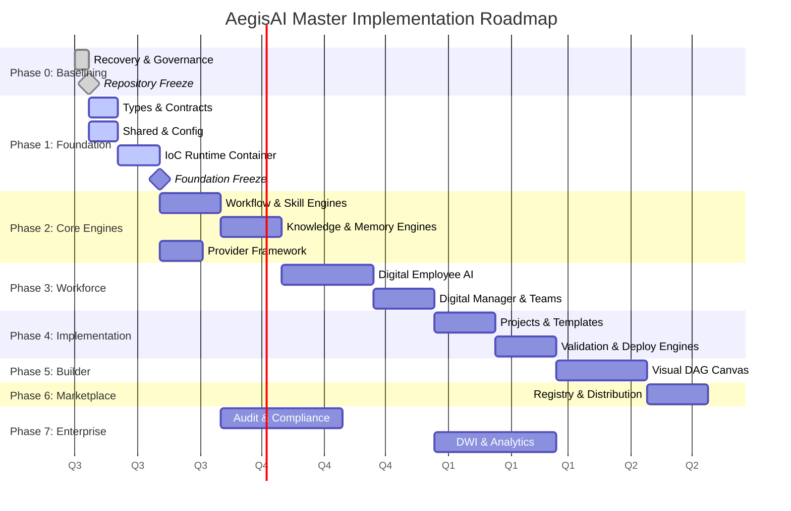

# Master Implementation Plan

## Purpose

The **Master Implementation Plan** is the single, authoritative execution roadmap for the AegisAI Platform. While the Blueprint defines _what_ the architecture is, and the Repository Constitution defines _how_ it is governed, this plan dictates exactly _when_ and _in what order_ components are physically constructed. No engineering effort may occur out of sequence.

---

## Strategic Roadmap

---

## Phase 0: Governance & Baselining

- **Objective:** Establish an unbreakable structural foundation and enforce strict architectural laws before code is written.
- **Deliverables:** Complete `.aegis` governance directory, pristine repository root, functioning CI/CD workspace.
- **Dependencies:** None.
- **Packages:** All monorepo scaffolding.
- **Verification:** Automated checks confirming zero corrupted files, clean `madge` dependency graphs, and 100% template alignment.
- **Definition of Done:** All architectural logic is frozen, historical files archived, and the workspace builds successfully.
- **Estimated Complexity:** Low
- **Risk:** Low
- **Freeze Criteria:** The Documentation Freeze Report is formally approved by the Chief Architect. _(Status: COMPLETED)_

---

## Phase 1: Foundation

- **Objective:** Implement the lowest-level execution interfaces, strict I/O boundaries, and the core Dependency Injection engine.
- **Deliverables:** Immutable Zod schemas, branded types, environment variable loaders, and the IoC Container.
- **Dependencies:** Phase 0.
- **Packages:** `@aegisai/types`, `@aegisai/contracts`, `@aegisai/shared`, `@aegisai/config`, `@aegisai/runtime`.
- **Verification:** `tsc --noEmit` cleanly compiles the foundation without a single typing error.
- **Definition of Done:** 100% unit test coverage on pure functions; strict type boundaries established.
- **Estimated Complexity:** High (Architectural complexity)
- **Risk:** Critical. A flaw here cascades through the entire platform.
- **Freeze Criteria:** The Foundation Freeze Certificate is issued, proving that Layer 1 and 2 interfaces are completely stable and agnostic to implementation details.

---

## Phase 2: Core Engines

- **Objective:** Build the logical processing units that manipulate data, graph structures, and LLM communication.
- **Deliverables:** Directed Acyclic Graph orchestrator, RAG indexer, episodic memory storage, and LLM abstraction layers.
- **Dependencies:** Phase 1 (Foundation Freeze).
- **Packages:** `@aegisai/workflow`, `@aegisai/provider`, `@aegisai/knowledge`, `@aegisai/memory`.
- **Verification:** Integration tests successfully invoking mock LLM providers and executing 3-node mock workflows.
- **Definition of Done:** Graph orchestrator can successfully suspend, rollback, and complete execution loops.
- **Estimated Complexity:** Very High
- **Risk:** High (Handling asynchronous non-determinism).
- **Freeze Criteria:** Engines can execute a test workflow end-to-end flawlessly in a headless environment.

---

## Phase 3: Digital Workforce

- **Objective:** Breathe cognitive life into the platform by assembling the Core Engines into autonomous personas.
- **Deliverables:** The Digital Employee state machine, Digital Manager orchestration logic, and inter-agent communication channels.
- **Dependencies:** Phase 2.
- **Packages:** `@aegisai/runtime`, `@aegisai/workflow`.
- **Verification:** A Digital Manager successfully delegates a multi-step task to a simulated Digital Team which executes to completion.
- **Definition of Done:** Agent state correctly transitions from `Planning` → `Executing` → `Validating` without human intervention.
- **Estimated Complexity:** Extreme
- **Risk:** High (Infinite loops, hallucination management).
- **Freeze Criteria:** Agents successfully adhere to all Guardian constraints defined in the `AGENT_STANDARD.md`.

---

## Phase 4: Implementation Platform

- **Objective:** Provide the structural frameworks allowing Digital Teams to deploy actual business value (e.g., software or infrastructure).
- **Deliverables:** Implementation Planners, Schedulers, Validation matrices, and automated Deployment Pipelines.
- **Dependencies:** Phase 3.
- **Packages:** `@aegisai/workflow`, `@aegisai/contracts`.
- **Verification:** An agent successfully outputs a validated Terraform manifest or code repository diff based on a business goal prompt.
- **Definition of Done:** Evidence Engine cryptographically signs the deployment payload.
- **Estimated Complexity:** High
- **Risk:** Medium
- **Freeze Criteria:** The platform can ingest a basic Implementation Template and execute it deterministically.

---

## Phase 5: Builder

- **Objective:** Democratize automation by providing humans with visual, no-code interfaces.
- **Deliverables:** Drag-and-drop Workflow canvas, Agent persona configurator, and Knowledge pack ingestion UI.
- **Dependencies:** Phase 4.
- **Packages:** `@aegisai/builder`, `@aegisai/ui`, `@aegisai/sdk`.
- **Verification:** E2E visual tests (e.g., Playwright) confirming a user can construct and save a 5-node workflow.
- **Definition of Done:** The UI correctly serializes visual graphs into valid `@aegisai/contracts` JSON payloads.
- **Estimated Complexity:** High (Frontend complexity)
- **Risk:** Medium
- **Freeze Criteria:** Builder successfully deploys a custom workflow to the Runtime engine.

---

## Phase 6: Marketplace

- **Objective:** Create the internal distribution ecosystem for enterprise reuse.
- **Deliverables:** Template registry, Skill registry, and package signing capabilities.
- **Dependencies:** Phase 5.
- **Packages:** `@aegisai/marketplace`, `@aegisai/ui`.
- **Verification:** Users can search, filter, download, and instantiate a signed Implementation Template.
- **Definition of Done:** Downloaded templates seamlessly integrate into the local Builder environment.
- **Estimated Complexity:** Medium
- **Risk:** Low
- **Freeze Criteria:** Cryptographic verification is mathematically proven to block unsigned or tampered templates.

---

## Phase 7: Enterprise Platform

- **Objective:** Wrap the entire ecosystem in massive-scale governance, telemetry, and compliance layers.
- **Deliverables:** Digital Workforce Intelligence (DWI) dashboards, WORM Audit ledger, SOC2/GDPR compliance gates.
- **Dependencies:** Phase 3, Phase 6.
- **Packages:** `@aegisai/monitoring`, `@aegisai/audit`, `@aegisai/guardian`, `@aegisai/ui`.
- **Verification:** Dashboards reflect real-time agent execution latency in milliseconds; Audit ledger rejects mutation attempts.
- **Definition of Done:** Human executives can actively monitor ROI, token burn, and agent productivity scores.
- **Estimated Complexity:** Very High
- **Risk:** High (Massive telemetry data volumes).
- **Freeze Criteria:** The platform is legally and operationally ready for production enterprise adoption.
