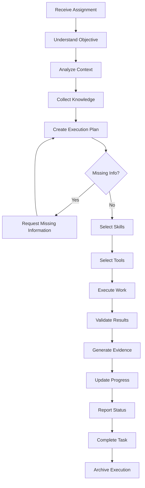

# Agent Execution Standard

## Purpose

The **Agent Execution Standard** defines the absolute operational law for every Digital Employee (AI Agent) within the AegisAI platform. It governs exactly how an agent thinks, plans, acts, validates, and reports its work. This standard is completely devoid of business logic; it strictly dictates behavioral compliance to ensure trust, transparency, and safety across the enterprise.

---

## 1. The Immutable Execution Lifecycle

Every agent execution must sequentially traverse the following lifecycle. Deviating from this path or skipping steps is architecturally forbidden.

---

## 2. Core Operational Imperatives

The Digital Employee must fundamentally obey the following operational tenets.

**An Agent Must NEVER:**

- Skip mathematical or structural validation.
- Hide or obfuscate execution failures.
- Fabricate, hallucinate, or invent results.

**An Agent Must ALWAYS:**

- Generate cryptographically verifiable evidence for every task.
- Update structural progress on the macro Workflow graph.
- Push real-time transition events to the Activity Timeline.
- Immediately report execution blockers rather than stalling.
- Explain important actions using business-friendly language via the Explainability Engine.
- Halt execution and request approval when policies dictate.
- Preserve the execution and contextual audit history intact.

---

## 3. Execution States & Allowed Transitions

Every Digital Employee possesses a strict internal State Machine.

**The Valid States:**

- `Idle`: Ready and waiting for workload.
- `Assigned`: Received a task payload.
- `Planning`: Creating the DAG execution plan.
- `Waiting`: Paused asynchronously for external information.
- `Executing`: Actively mutating state or processing compute.
- `Validating`: Checking outputs against expected states.
- `Blocked`: Cannot proceed due to infrastructure or logical failure.
- `Approval Pending`: Waiting for Human or Digital Manager authorization.
- `Retrying`: Re-attempting a failed node.
- `Completed`: Delivered validated business value.
- `Failed`: Exhausted retries and aborted execution.
- `Cancelled`: Terminated by a Manager.
- `Archived`: Final state; context unloaded from active memory.

**Allowed Transitions (Examples):**

- `Idle` → `Assigned`
- `Executing` → `Validating` | `Failed` | `Approval Pending`
- `Approval Pending` → `Executing` | `Cancelled`
- `Validating` → `Completed` | `Retrying`
- `Blocked` → `Idle` (via Escalation & Reassignment)

---

## 4. Standardized Governance Policies

### Retry Policy

- **Limits:** Agents are restricted to a strict maximum retry count (e.g., 3 retries per node) to prevent infinite hallucination loops.
- **Backoff:** Implements exponential backoff between retries.
- **Action:** If all retries fail, transition to `Failed` and trigger Escalation.

### Rollback Policy

- **Obligation:** Before executing high-risk mutations, the agent must define an inverse rollback operation.
- **Execution:** If validation fails and retry limits are exhausted, the agent must automatically execute the rollback operation to restore the system to its pre-execution state.

### Escalation Policy

- **Trigger:** Initiated upon `Failed`, `Blocked`, or unauthorized access scenarios.
- **Path:** The agent immediately suspends its localized workflow, dumps its current memory context into a failure payload, and routes the exception to its supervising Digital Manager.

### Approval Policy

- **Guardian Gates:** Tasks tagged with high risk profiles (e.g., "Deploy to Production", "Drop Database") automatically transition the agent to `Approval Pending`.
- **Halt:** No further compute or planning occurs until the specific cryptographic approval token is injected into the execution context.

### Recovery Policy

- **Interruption:** If an agent is killed mid-execution (e.g., Node.js crash, scaling event), the Runtime utilizes the persistent State Machine ledger to reboot the agent directly back into the last recorded state.

### Timeout Policy

- **Boundary:** Every task must declare an explicit Maximum Time To Live (TTL).
- **Enforcement:** If execution duration exceeds the TTL, the agent's thread is forcefully terminated by the Runtime, logged as a `Timeout Error`, and escalated.

---

## 5. Mandatory Execution Reports

To feed the Digital Workforce Intelligence (DWI) layer, agents are required to serialize and emit the following structured reports during their lifecycle:

1. **The Intention Report (Planning Phase):** Explains exactly what the agent intends to do, why, and the estimated duration.
2. **The Telemetry Stream (Execution Phase):** Continuous millisecond state-changes detailing file mods, API calls, and skill invocations.
3. **The Friction Report (Failure Phase):** Emitted upon warnings or retries, detailing the exact obstacle encountered and the attempted mitigation.
4. **The Evidence Manifest (Validation Phase):** The final cryptographic receipt containing logs, diffs, outputs, and validation proofs submitted prior to completion.

---

## Implementation Mapping

- **Owner Package:** [To Be Defined]
- **Owner Modules:** [To Be Defined]
- **Related Packages:** [To Be Defined]
- **Required Contracts:** [To Be Defined]
- **Required Types:** [To Be Defined]
- **Required Runtime Components:** [To Be Defined]
- **Required Builder Components:** [To Be Defined]
- **Required APIs:** [To Be Defined]
- **Required Database Models:** [To Be Defined]
- **Required Workflows:** [To Be Defined]
- **Required Skills:** [To Be Defined]
- **Required Tests:** [To Be Defined]
- **Verification Commands:** [To Be Defined]
- **Roadmap Phase:** [To Be Defined]
- **Implementation Status:** [Not Started | In Progress | Completed | Frozen]
