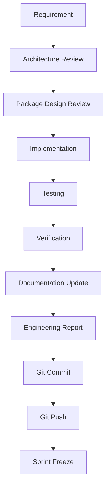

# Engineering Sprint Standard

## Purpose

The **Engineering Sprint Standard** dictates the mandatory, unyielding workflow for every discrete implementation cycle within the AegisAI platform. AI-assisted and human engineering velocity is incredibly high; without a rigid, standardized lifecycle controlling state transitions and evidence generation, chaos and technical debt quickly accumulate. This standard ensures that every block of work is systematically designed, verified, and audited before entering the main repository state.

---

## 1. The Immutable Sprint Lifecycle

Every engineering sprint must sequentially execute the following steps. Bypassing any step is a fatal architectural violation.

---

## 2. Sprint Initialization (Definition)

Before a single line of code is modified, the Engineering or Digital Team must explicitly state the parameters of the Sprint in the `IMPLEMENTATION_BACKLOG.md` or a dedicated PR description:

- **Sprint ID:** Unique identifier mapping to the Implementation Backlog (e.g., `S-P3-01`).
- **Objective:** The precise business or technical goal to be achieved.
- **Packages:** The exact boundaries of the monorepo being modified (e.g., `@aegisai/runtime`, `@aegisai/contracts`).
- **Dependencies:** Other packages or sprints that must be completed prior.
- **Risks:** Architectural vulnerabilities or blockers associated with the implementation.
- **Deliverables:** The tangible code outputs or binary artifacts expected.
- **Verification Commands:** The exact CLI strings required to mathematically prove success (e.g., `pnpm --filter @aegisai/contracts test`).
- **Definition of Done:** The absolute boolean constraints required to close the sprint.

---

## 3. Sprint Closure (Mandatory Outputs)

At the conclusion of the sprint, prior to `Git Push`, the executing agent or engineer must generate a standardized **Engineering Report** containing:

- **Implementation Summary:** What was built and why.
- **Files Created:** Explicit list of new files.
- **Files Modified:** Explicit list of mutated files.
- **Tests Added:** Proof of testing coverage.
- **Verification Results:** The raw stdout/stderr demonstrating build/test success.
- **Known Issues:** Any low-severity bugs deferred to the Technical Debt Register.
- **Technical Debt:** Any technical shortcuts taken that require future refactoring.
- **Architecture Changes:** Any minor modifications to dependency graphs or internal models.
- **Next Sprint:** The logical subsequent phase of work.

---

## 4. Sprint Metrics

Every closed sprint must record quantitative execution metrics to track platform engineering velocity and quality:

- **Lines Added / Removed:** Scope of the mutation.
- **Files Modified:** Breadth of the mutation.
- **Tests:** Number of passing assertions.
- **Coverage:** Percentage of execution paths covered by testing (Target: 100% for Core Packages).
- **Verification Status:** Pass/Fail outcome of CI/CD pipelines.
- **Build Status:** Topological compilation success across the monorepo graph.
- **Package Status:** The transition of the modified package state (e.g., `Draft` → `Testing` → `Frozen`).

---

## Implementation Mapping

- **Owner Package:** Platform Governance
- **Owner Modules:** Engineering Processes
- **Related Packages:** None
- **Required Contracts:** None
- **Required Types:** None
- **Required Runtime Components:** None
- **Required Builder Components:** None
- **Required APIs:** None
- **Required Database Models:** None
- **Required Workflows:** CI/CD Integration
- **Required Skills:** None
- **Required Tests:** None
- **Verification Commands:** `cat .aegis/governance/ENGINEERING_SPRINT_STANDARD.md`
- **Roadmap Phase:** Phase 2
- **Implementation Status:** Completed
