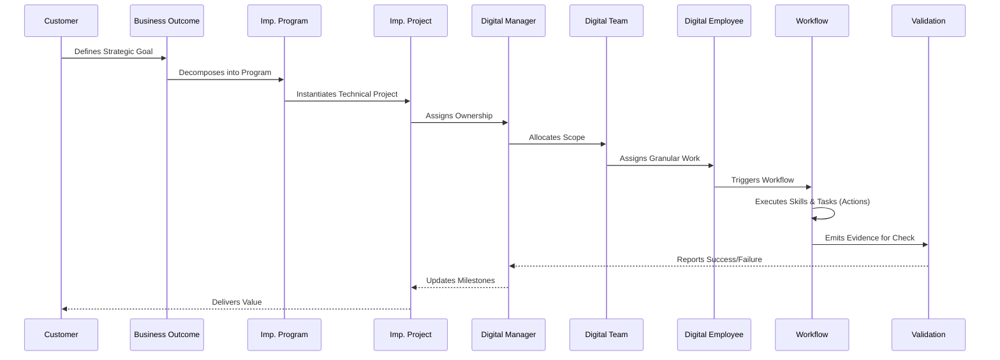

# Platform Execution Model

## Purpose

The **Execution Model** defines the absolute lifecycle of work flowing through the AegisAI Platform. It maps the deterministic transformation of a high-level human business objective into granular, auditable actions performed by autonomous entities. This document acts as the definitive operational reference for how intelligence cascades into reality.

---

## The Execution Cascade

---

## 1. Customer

- **Purpose:** The sovereign entity driving the business requirement.
- **Inputs:** Strategic vision, budgetary constraints, security requirements.
- **Outputs:** Approved objectives.
- **Responsibilities:** Defining success criteria and providing manual intervention overrides.
- **State Transitions:** `Ideation` → `Approved` → `Delivered`.
- **Failure Handling:** Not applicable (Human layer).
- **Approval Policy:** Final authority for all overarching platform deployment approvals.
- **Reporting & Audit:** Consumes macro-level Executive Dashboards.

## 2. Business Outcome

- **Purpose:** The formalized, measurable strategic goal.
- **Inputs:** Customer intent.
- **Outputs:** Key Performance Indicators (KPIs) and technical constraints.
- **Responsibilities:** Bridging business semantics with technical deliverables.
- **State Transitions:** `Draft` → `Active` → `Achieved` | `Abandoned`.
- **Failure Handling:** Re-evaluation of underlying implementation logic if KPIs are missed.
- **Evidence Generation:** Strategic delivery reports.
- **Reporting & Audit:** Audited via the Governance ledger.

## 3. Implementation Program

- **Purpose:** A collection of highly cohesive Implementation Projects designed to achieve a specific Business Outcome.
- **Inputs:** Business Outcome definitions.
- **Outputs:** Architectural roadmaps and dependency graphs.
- **Responsibilities:** Managing long-term timelines and cross-project dependencies.
- **State Transitions:** `Planning` → `Executing` → `Completed`.
- **Failure Handling:** Program-level rollback or scope reduction.
- **Retry Policy:** Strategic realignment triggered by the Digital Manager.
- **Reporting & Audit:** Executive milestone reporting.

## 4. Implementation Project

- **Purpose:** A bounded technical delivery initiative (e.g., "Deploy Auth Service").
- **Inputs:** Program requirements and allocated digital resources.
- **Outputs:** Shipped capabilities.
- **Responsibilities:** Tracking granular milestones, risk, and budget consumption.
- **State Transitions:** `Backlog` → `In Progress` → `Validating` → `Done`.
- **Failure Handling:** Halting execution and requesting human intervention upon critical errors.
- **Approval Policy:** Requires Digital Manager sign-off before entering `Validating`.
- **Evidence Generation:** Source code diffs, infrastructure definitions.
- **Reporting:** Sent to Team Manager Dashboards.

## 5. Digital Manager

- **Purpose:** The autonomous orchestration node supervising Digital Teams.
- **Inputs:** Project constraints, timeline limits.
- **Outputs:** Task allocations and performance reports.
- **Responsibilities:** Work prioritization, dependency coordination, and quality assurance.
- **State Transitions:** `Idle` → `Supervising` → `Escalating`.
- **Failure Handling:** Reassigns failing tasks or escalates to a Human Manager.
- **Retry Policy:** Triggers automated retries across alternative agents if primary agents fail.
- **Approval Policy:** Can autonomously approve low-risk workflows.
- **Reporting & Audit:** Every managerial action is permanently immutably logged.

## 6. Digital Team

- **Purpose:** A cohesive unit of Digital Employees (AI Agents) specialized in a domain.
- **Inputs:** Delegated workload from the Digital Manager.
- **Outputs:** Completed workflow phases.
- **Responsibilities:** Load balancing tasks among specific agent roles.
- **State Transitions:** `Available` → `At Capacity` → `Blocked`.
- **Failure Handling:** Swarms failing agents with peer review if configured.
- **Evidence Generation:** Team-wide utilization and efficiency metrics.

## 7. Digital Employee

- **Purpose:** The singular AI Agent responsible for direct cognitive execution.
- **Inputs:** Assigned Workflows and contextual memory.
- **Outputs:** Finished tasks and generated evidence.
- **Responsibilities:** Executing assigned skills safely within Guardian boundaries.
- **State Transitions:** `Idle` → `Reasoning` → `Executing` → `Waiting for Approval`.
- **Failure Handling:** Attempts self-healing or fails gracefully with clear error context.
- **Retry Policy:** Strictly limited by `maxRetries` per the package configuration to prevent infinite loops.
- **Reporting:** Emits real-time data to the Agent Activity Intelligence dashboard.

## 8. Workflow

- **Purpose:** The Directed Acyclic Graph (DAG) of actionable logic.
- **Inputs:** Pre-requisite data states.
- **Outputs:** Fully transformed data or environment mutations.
- **Responsibilities:** Enforcing deterministic execution steps.
- **State Transitions:** `Pending` → `Running` → `Suspended` → `Completed`.
- **Failure Handling:** Triggers defined compensation (rollback) workflows on node failure.
- **Retry Policy:** Per-node exponential backoff.
- **Audit:** Workflow shape and execution path are crypotgraphically logged.

## 9. Skill

- **Purpose:** A specific, isolated technical capability (e.g., "Write TypeScript File").
- **Inputs:** Parameterized arguments from the Workflow.
- **Outputs:** Functional results.
- **Responsibilities:** Executing narrow logic flawlessly.
- **State Transitions:** `Invoked` → `Resolving` → `Finished`.
- **Failure Handling:** Returns explicit typed error objects (never throws uncaught exceptions).
- **Approval Policy:** High-risk skills automatically trigger a human-in-the-loop pause.

## 10. Task & Action

- **Purpose:** The atomic unit of computational work (Task) and the instantaneous environmental change (Action).
- **Inputs:** Raw tool arguments.
- **Outputs:** Environment mutations.
- **Responsibilities:** Changing state safely.
- **State Transitions:** `Unstarted` → `Committed`.
- **Failure Handling:** Immediate abort if syntax or execution context is invalid.
- **Evidence Generation:** Emits exact action traces (e.g., "Modified line 42").

## 11. Evidence

- **Purpose:** Cryptographic proof that an Action or Task was completed successfully.
- **Inputs:** System stdout, API responses, screenshots.
- **Outputs:** WORM (Write-Once-Read-Many) compliant logs.
- **Responsibilities:** Ensuring absolute explainability.
- **Audit:** Ingested instantly by the `@aegisai/audit` module.

## 12. Validation

- **Purpose:** The automated or manual verification that Evidence matches the Expected Outcome.
- **Inputs:** Evidence payloads.
- **Outputs:** Pass/Fail verdicts.
- **Responsibilities:** Protecting the platform from hallucinations or logic drift.
- **State Transitions:** `Pending Verification` → `Validated` | `Rejected`.
- **Failure Handling:** Rejects send the Workflow back to the Digital Employee for correction.

## 13. Completion

- **Purpose:** The terminal, irreversible conclusion of the Execution Flow.
- **Inputs:** Validated results.
- **Outputs:** Released business value.
- **Responsibilities:** Closing loops and updating macro-level KPIs on the Executive Dashboard.
- **Reporting:** Generates the final Phase Completion Certificate.
- **Audit:** Permanently archives the complete execution lifecycle graph.

---

## Implementation Mapping

- **Owner Package:** [To Be Defined]
- **Owner Modules:** [To Be Defined]
- **Related Packages:** [To Be Defined]
- **Required Contracts:** [To Be Defined]
- **Required Types:** [To Be Defined]
- **Required Runtime Components:** [To Be Defined]
- **Required Builder Components:** [To Be Defined]
- **Required APIs:** [To Be Defined]
- **Required Database Models:** [To Be Defined]
- **Required Workflows:** [To Be Defined]
- **Required Skills:** [To Be Defined]
- **Required Tests:** [To Be Defined]
- **Verification Commands:** [To Be Defined]
- **Roadmap Phase:** [To Be Defined]
- **Implementation Status:** [Not Started | In Progress | Completed | Frozen]
