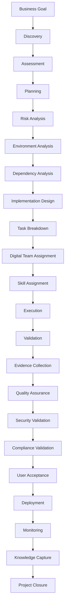
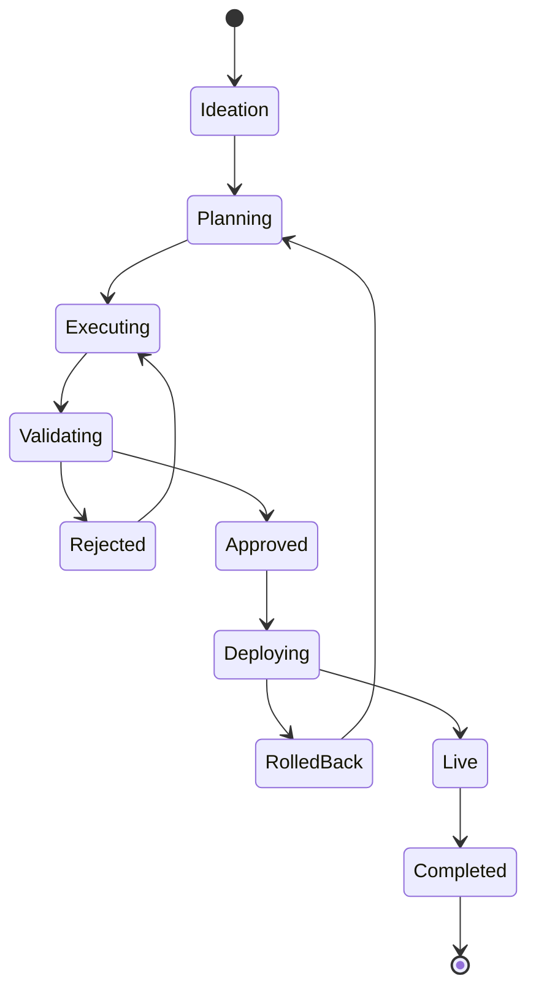
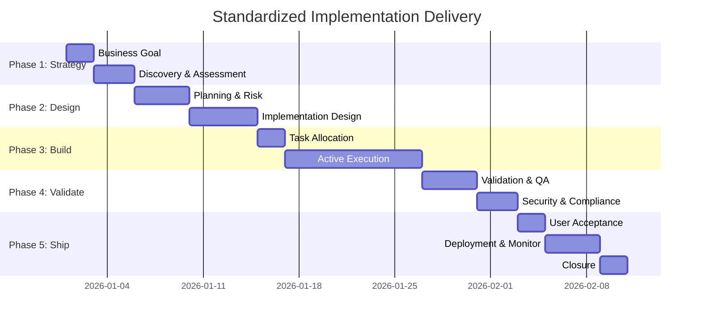

# Universal Implementation Methodology

## Purpose

The **Universal Implementation Methodology** serves as the definitive, immutable lifecycle for all technical deployments and migrations executed by AegisAI Digital Teams. This framework is completely agnostic to the underlying technology stack; whether deploying a global AWS infrastructure, migrating millions of records in Salesforce, configuring SAP ERP, or deploying custom microservices, the execution phases remain structurally identical.

This absolute standardization allows Human Supervisors and Digital Managers to govern vastly disparate technologies through a singular, predictable pane of glass.

---

## 1. Architectural Diagrams

### 1.1 Methodology Workflow

### 1.2 Execution State Machine

### 1.3 Implementation Timeline (Gantt)

---

## 2. The 22-Phase Execution Lifecycle

_(Note: Every single phase below must be sequentially completed. Bypassing a phase is an architectural violation.)_

### 1. Business Goal

- **Purpose:** Define the exact strategic objective (e.g., "Migrate legacy on-prem CRM to Salesforce").
- **Inputs:** Customer intent, strategic roadmap.
- **Outputs:** Formalized Goal Document.
- **Required Skills:** Strategic Reasoning, Business Analysis.
- **Required Evidence:** Approved Goal Document.
- **Validation:** Human stakeholder sign-off.
- **Approval:** Human Manager.
- **Failure Handling:** Re-evaluate business constraints.
- **Rollback:** Abandon initiative.
- **Reporting:** Sent to Executive Dashboard.
- **KPIs:** Goal clarity score.

### 2. Discovery

- **Purpose:** Map the exact current state (AS-IS).
- **Inputs:** Business Goal, existing documentation.
- **Outputs:** Asset inventory, Current State Architecture.
- **Required Skills:** Network Scanning, Code Parsing, API Discovery.
- **Required Evidence:** Asset Map JSON.
- **Validation:** Automated reconciliation against known environments.
- **Approval:** Digital Manager.
- **Failure Handling:** Broaden discovery scopes or request manual credentials.
- **Rollback:** Purge discovered cache.
- **Reporting:** Discovery Progress via DWI.
- **KPIs:** Discovery depth, Unmapped assets.

### 3. Assessment

- **Purpose:** Evaluate the gap between AS-IS and the Business Goal.
- **Inputs:** Discovery Asset Map, Business Goal.
- **Outputs:** Gap Analysis Report.
- **Required Skills:** Systems Engineering, Data Modeling.
- **Required Evidence:** Gap Identification Document.
- **Validation:** Coverage check ensuring all goals are mapped to a gap.
- **Approval:** Digital Manager.
- **Failure Handling:** Restart Discovery for missing context.
- **Rollback:** N/A.
- **Reporting:** Sent to Team Manager.
- **KPIs:** Gap severity index.

### 4. Planning

- **Purpose:** Construct the high-level roadmap to close the gaps.
- **Inputs:** Gap Analysis Report.
- **Outputs:** Project Charter, Macro Timeline.
- **Required Skills:** Project Management, Agile Estimation.
- **Required Evidence:** Generated Gantt charts and Milestone definitions.
- **Validation:** Schedule viability against hard constraints.
- **Approval:** Human Manager.
- **Failure Handling:** Reduce scope or extend timeline.
- **Rollback:** Discard charter.
- **Reporting:** Executive Dashboard.
- **KPIs:** Time-to-Plan latency.

### 5. Risk Analysis

- **Purpose:** Identify all potential execution threats.
- **Inputs:** Project Charter.
- **Outputs:** Risk Register.
- **Required Skills:** Cyber Security, Infrastructure Architecture.
- **Required Evidence:** Formal Risk Assessment Markdown.
- **Validation:** Automated policy check against enterprise risk thresholds.
- **Approval:** Guardian Subsystem.
- **Failure Handling:** Flag project as "High Risk" requiring manual overrides.
- **Rollback:** N/A.
- **Reporting:** Risk Dashboard.
- **KPIs:** Number of Critical Risks identified.

### 6. Environment Analysis

- **Purpose:** Verify the target deployment environment is capable of supporting the solution.
- **Inputs:** Target architecture requirements.
- **Outputs:** Environment Readiness Report.
- **Required Skills:** Cloud Provisioning, Hardware Diagnostics.
- **Required Evidence:** Output of environmental health checks (e.g., `terraform plan`).
- **Validation:** Resources match required allocations.
- **Approval:** Digital Manager.
- **Failure Handling:** Trigger environment upgrade tasks.
- **Rollback:** N/A.
- **Reporting:** Resource utilization metrics.
- **KPIs:** Readiness Score.

### 7. Dependency Analysis

- **Purpose:** Map all internal, external, and logical dependencies.
- **Inputs:** Environment Map, Risk Register.
- **Outputs:** Directed Acyclic Graph (DAG) of dependencies.
- **Required Skills:** Systems Analysis.
- **Required Evidence:** Dependency Graph JSON.
- **Validation:** Zero circular dependencies detected.
- **Approval:** Digital Manager.
- **Failure Handling:** Restructure logic to break cycles.
- **Rollback:** N/A.
- **Reporting:** Architecture Dashboard.
- **KPIs:** Graph complexity.

### 8. Implementation Design

- **Purpose:** Finalize the exact technical blueprint (TO-BE).
- **Inputs:** Dependency DAG.
- **Outputs:** Solution Architecture Document.
- **Required Skills:** Solutions Architecture.
- **Required Evidence:** UML/Mermaid diagrams, API specifications.
- **Validation:** Static analysis of proposed architecture against Blueprint constraints.
- **Approval:** Chief Architect / Human Supervisor.
- **Failure Handling:** Redesign phase.
- **Rollback:** Discard design.
- **Reporting:** Design Review completion.
- **KPIs:** Design compliance score.

### 9. Task Breakdown

- **Purpose:** Decompose the design into atomic, executable instructions.
- **Inputs:** Solution Architecture Document.
- **Outputs:** Granular Task Backlog.
- **Required Skills:** Agile Planning.
- **Required Evidence:** Populated ticket queue.
- **Validation:** 100% of the design is accounted for in the backlog.
- **Approval:** Digital Manager.
- **Failure Handling:** Regenerate backlog.
- **Rollback:** Flush queue.
- **Reporting:** Backlog size and burn-down projection.
- **KPIs:** Average task complexity.

### 10. Digital Team Assignment

- **Purpose:** Allocate work to specific Digital Teams based on domain.
- **Inputs:** Task Backlog.
- **Outputs:** Assigned queues.
- **Required Skills:** Orchestration.
- **Required Evidence:** Routing logs.
- **Validation:** Teams assigned have sufficient capacity.
- **Approval:** Automatic.
- **Failure Handling:** Queue balancing.
- **Rollback:** N/A.
- **Reporting:** Team utilization.
- **KPIs:** Load distribution balance.

### 11. Skill Assignment

- **Purpose:** Allocate exact technical Skills (e.g., "Deploy ARM Template") to specific Agents.
- **Inputs:** Assigned queues.
- **Outputs:** Loaded Agent memories.
- **Required Skills:** Orchestration.
- **Required Evidence:** Execution initialization logs.
- **Validation:** Agent possesses required Skill definition.
- **Approval:** Automatic.
- **Failure Handling:** Fallback to generalized reasoning if specific skill fails to load.
- **Rollback:** N/A.
- **Reporting:** Skill usage heatmaps.
- **KPIs:** Skill-to-Task match rate.

### 12. Execution

- **Purpose:** Actually mutate state and build the solution.
- **Inputs:** Context, Skills, Tasks.
- **Outputs:** Code, infrastructure, configurations.
- **Required Skills:** Varies (Programming, Cloud, DevOps, Database).
- **Required Evidence:** Code commits, terminal outputs.
- **Validation:** Pre-flight linting and typechecking.
- **Approval:** Automatic (unless Guardian gate triggered).
- **Failure Handling:** Retry policy with exponential backoff.
- **Rollback:** Discard uncommitted changes.
- **Reporting:** Real-time Activity Timeline.
- **KPIs:** Execution velocity, Error rate.

### 13. Validation

- **Purpose:** Mathematically prove the execution was successful.
- **Inputs:** Execution outputs.
- **Outputs:** Validation verdict.
- **Required Skills:** Testing, QA Automation.
- **Required Evidence:** Test suite output logs.
- **Validation:** CI/CD pipeline executes flawlessly.
- **Approval:** Automatic upon green build.
- **Failure Handling:** Re-route back to Execution (Bug fix loop).
- **Rollback:** N/A.
- **Reporting:** Test coverage metrics.
- **KPIs:** First-pass yield.

### 14. Evidence Collection

- **Purpose:** Aggregate all proof of work for the Audit ledger.
- **Inputs:** Validated results, logs.
- **Outputs:** Cryptographic Evidence Payload.
- **Required Skills:** Data Aggregation.
- **Required Evidence:** The WORM log entry.
- **Validation:** Hash verification.
- **Approval:** Automatic.
- **Failure Handling:** Retry collection.
- **Rollback:** N/A.
- **Reporting:** Audit Trail UI.
- **KPIs:** Evidence completeness.

### 15. Quality Assurance

- **Purpose:** Deep systemic and integration testing.
- **Inputs:** Deployed staging environment.
- **Outputs:** QA Sign-off.
- **Required Skills:** Integration Testing, E2E Testing.
- **Required Evidence:** QA Pass/Fail matrix.
- **Validation:** All acceptance criteria met.
- **Approval:** Digital Manager.
- **Failure Handling:** Generate bug tickets and route to Backlog.
- **Rollback:** Revert staging environment.
- **Reporting:** Defect density.
- **KPIs:** QA pass rate.

### 16. Security Validation

- **Purpose:** Penetration testing and static vulnerability scanning.
- **Inputs:** Staging environment, source code.
- **Outputs:** Security Sign-off.
- **Required Skills:** Cybersecurity, SAST/DAST.
- **Required Evidence:** Security Scan Report.
- **Validation:** Zero Critical/High CVEs detected.
- **Approval:** Guardian Subsystem.
- **Failure Handling:** Hard halt; route immediate remediation tasks.
- **Rollback:** Quarantined deployment.
- **Reporting:** Vulnerability Dashboard.
- **KPIs:** Security score.

### 17. Compliance Validation

- **Purpose:** Ensure the solution adheres to enterprise and regulatory policies (e.g., GDPR, HIPAA).
- **Inputs:** Security Report, Architecture Document.
- **Outputs:** Compliance Sign-off.
- **Required Skills:** Regulatory Analysis.
- **Required Evidence:** Policy adherence matrix.
- **Validation:** Automated policy evaluation (e.g., Open Policy Agent).
- **Approval:** Guardian Subsystem.
- **Failure Handling:** Hard halt.
- **Rollback:** N/A.
- **Reporting:** Compliance Dashboard.
- **KPIs:** Compliance adherence rate.

### 18. User Acceptance

- **Purpose:** Final human verification before production release.
- **Inputs:** Staging environment, QA/Security/Compliance reports.
- **Outputs:** Go/No-Go Decision.
- **Required Skills:** Human Evaluation.
- **Required Evidence:** Cryptographic Approval Token.
- **Validation:** Stakeholder signature.
- **Approval:** Human Supervisor.
- **Failure Handling:** Route feedback to Planning.
- **Rollback:** N/A.
- **Reporting:** UAT metrics.
- **KPIs:** UAT duration.

### 19. Deployment

- **Purpose:** Release the solution into production.
- **Inputs:** Approval Token, Deployment Manifest.
- **Outputs:** Live Production System.
- **Required Skills:** CI/CD Orchestration, Release Management.
- **Required Evidence:** Production health check success logs.
- **Validation:** Post-deployment smoke tests.
- **Approval:** Automatic (Pre-approved by UAT).
- **Failure Handling:** Execute predefined Rollback Strategy instantly.
- **Rollback:** Restore previous production state from snapshot.
- **Reporting:** Release Dashboard.
- **KPIs:** Mean Time to Deploy (MTTD).

### 20. Monitoring

- **Purpose:** Watch the live system for anomalies.
- **Inputs:** Live telemetry streams.
- **Outputs:** System Health Alerts.
- **Required Skills:** Observability, Telemetry.
- **Required Evidence:** Metric dashboards (e.g., Grafana/Prometheus logic).
- **Validation:** Metrics fall within expected thresholds.
- **Approval:** Automatic.
- **Failure Handling:** Trigger Incident Response workflow.
- **Rollback:** Trigger automated failover.
- **Reporting:** Uptime Dashboard.
- **KPIs:** Availability SLA (e.g., 99.99%).

### 21. Knowledge Capture

- **Purpose:** Update the organizational memory with lessons learned.
- **Inputs:** Complete execution timeline, incident reports.
- **Outputs:** New RAG documents and updated Skill parameters.
- **Required Skills:** Technical Writing, Semantic Indexing.
- **Required Evidence:** New vector embeddings.
- **Validation:** Embedding consistency check.
- **Approval:** Digital Manager.
- **Failure Handling:** Re-index.
- **Rollback:** N/A.
- **Reporting:** Knowledge base growth.
- **KPIs:** Artifacts generated.

### 22. Project Closure

- **Purpose:** Formally terminate the Implementation Project and release resources.
- **Inputs:** All previous artifacts and metrics.
- **Outputs:** Final Phase Completion Certificate.
- **Required Skills:** Orchestration.
- **Required Evidence:** Closed ledger entry.
- **Validation:** All 21 previous phases are marked complete.
- **Approval:** Human Supervisor.
- **Failure Handling:** Flag for manual closure.
- **Rollback:** N/A.
- **Reporting:** Executive Dashboard.
- **KPIs:** Total cost, Total duration, Final ROI.

---

## Implementation Mapping

- **Owner Package:** [To Be Defined]
- **Owner Modules:** [To Be Defined]
- **Related Packages:** [To Be Defined]
- **Required Contracts:** [To Be Defined]
- **Required Types:** [To Be Defined]
- **Required Runtime Components:** [To Be Defined]
- **Required Builder Components:** [To Be Defined]
- **Required APIs:** [To Be Defined]
- **Required Database Models:** [To Be Defined]
- **Required Workflows:** [To Be Defined]
- **Required Skills:** [To Be Defined]
- **Required Tests:** [To Be Defined]
- **Verification Commands:** [To Be Defined]
- **Roadmap Phase:** [To Be Defined]
- **Implementation Status:** [Not Started | In Progress | Completed | Frozen]
