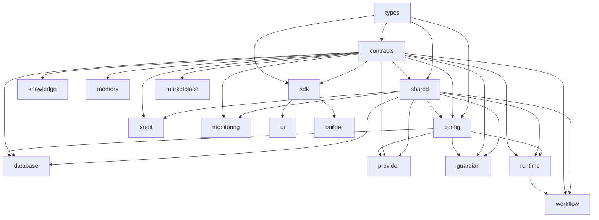
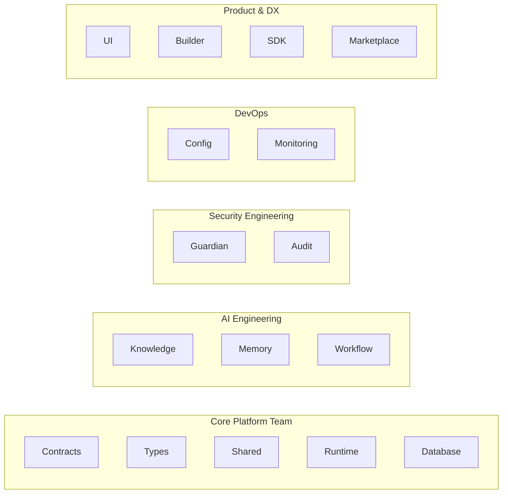

# Package Dependency Graph

## Purpose

The **Package Dependency Graph** is the definitive engineering reference for the AegisAI platform. It governs exactly how architectural boundaries are respected, preventing cyclical dependencies and structural monolithing. All internal packages must strictly conform to these topological constraints.

---

## 1. Layered Package Architecture

The platform is strictly segmented into execution tiers. Packages belong to exactly one tier.

```mermaid
graph TD
    subgraph Layer 5 [Presentation & Product]
        UI["@aegisai/ui"]
        Builder["@aegisai/builder"]
    end

    subgraph Layer 4 [Client & Boundary]
        SDK["@aegisai/sdk"]
        Marketplace["@aegisai/marketplace"]
    end

    subgraph Layer 3 [Domain Execution]
        Runtime["@aegisai/runtime"]
        Workflow["@aegisai/workflow"]
        Knowledge["@aegisai/knowledge"]
        Memory["@aegisai/memory"]
    end

    subgraph Layer 2 [Infrastructure]
        Database["@aegisai/database"]
        Provider["@aegisai/provider"]
        Audit["@aegisai/audit"]
        Monitoring["@aegisai/monitoring"]
        Guardian["@aegisai/guardian"]
        Shared["@aegisai/shared"]
        Config["@aegisai/config"]
    end

    subgraph Layer 1 [Foundation]
        Contracts["@aegisai/contracts"]
        Types["@aegisai/types"]
    end

    Layer 5 -.-> Layer 4
    Layer 4 -.-> Layer 3
    Layer 3 -.-> Layer 2
    Layer 2 -.-> Layer 1
```

---

## 2. Dependency Rules



- **Unidirectional Flow:** Dependencies must only point downward through the layers.
- **Decoupled Business Logic:** Business and UI layers (`ui`, `builder`, `marketplace`) must not directly access data stores (`database`, `memory`). They must rely on the `sdk`.

---

## 3. Allowed Imports

- Packages may import any public API (`src/index.ts`) from a package situated in a lower tier.
- Internal Monorepo references must be explicitly defined in `package.json` utilizing exact workspace semantics (e.g., `"@aegisai/contracts": "workspace:*"`).

## 4. Forbidden Imports

- **Upward Dependencies:** Lower-tier packages (e.g., `contracts`, `database`) cannot import from higher-tier packages (`runtime`, `ui`).
- **Lateral Domain Coupling:** Packages in Layer 3 (`workflow`, `knowledge`, `memory`) cannot import from each other directly; they must interact via inverted interfaces in `contracts`.
- **Deep Bypassing:** Importing internal non-exported files (e.g., `import { Foo } from "@aegisai/runtime/dist/internal"`) is strictly forbidden.

## 5. Circular Dependency Policy

- **Zero Tolerance:** Any cyclic reference between two packages is a fatal architectural violation.
- **Enforcement:** The build pipeline executes topological analysis (`npx madge --circular`). If a cycle is detected, the build immediately aborts with status code 1.

---

## 6. Package Ownership



Every package is owned by a singular engineering division responsible for PR reviews, test coverage, and architectural health within that boundary.

## 7. Extension Package Rules

- Extension packages (e.g., `@aegisai/provider-aws`, `@aegisai/provider-openai`) contain external vendor-specific logic.
- They must strictly implement the interfaces defined in `@aegisai/contracts`.
- Core packages (like `runtime`) are forbidden from importing specific Extension Packages. They rely exclusively on Dependency Injection.

## 8. Shared Contracts

- `@aegisai/contracts` is the absolute central nervous system of the platform.
- It contains Zod schemas, interface declarations, and payload types.
- Contracts must be completely agnostic to underlying implementations (e.g., no raw SQL queries or specific HTTP libraries in the contract definitions).

## 9. Version Compatibility

- The Monorepo utilizes synchronized versioning managed by Changesets.
- If a fundamental Layer 1 package (`contracts`, `types`) bumps a major version due to a breaking structural change, the entire monorepo must be topologically updated and tested simultaneously to guarantee cascading stability.

## 10. Public API Rules

- Every package exposes exactly one public interface surface via its root `src/index.ts`.
- The public API must be highly cohesive. If a package exports two completely unrelated domains, it has violated the Single Responsibility Principle and must be divided.
- Any modification that removes or renames an export is a breaking change requiring an explicit ADR.

---

## Implementation Mapping

- **Owner Package:** [To Be Defined]
- **Owner Modules:** [To Be Defined]
- **Related Packages:** [To Be Defined]
- **Required Contracts:** [To Be Defined]
- **Required Types:** [To Be Defined]
- **Required Runtime Components:** [To Be Defined]
- **Required Builder Components:** [To Be Defined]
- **Required APIs:** [To Be Defined]
- **Required Database Models:** [To Be Defined]
- **Required Workflows:** [To Be Defined]
- **Required Skills:** [To Be Defined]
- **Required Tests:** [To Be Defined]
- **Verification Commands:** [To Be Defined]
- **Roadmap Phase:** [To Be Defined]
- **Implementation Status:** [Not Started | In Progress | Completed | Frozen]
